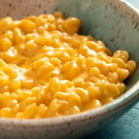

# [3-Ingredient Stovetop Mac and Cheese](https://www.seriouseats.com/ingredient-stovetop-mac-and-cheese-recipe)
> **tags**: #Easy #5star

## Description

## Ingredients

- 6 ounces (170g) elbow macaroni
- Salt
- 6 ounces (180ml) evaporated milk
- 6 ounces (170g) grated mild or medium cheddar cheese, or any good melting cheese, such as Fontina, Gruyère, or Jack

## Directions
Place macaroni in a medium saucepan or skillet and add just enough cold water to cover. Add a pinch of salt and bring to a boil over high heat, stirring frequently. Continue to cook, stirring, until water has been almost completely absorbed and macaroni is just shy of al dente, about 6 minutes.

Immediately add evaporated milk and bring to a boil. Add cheese. Reduce heat to low and cook, stirring continuously, until cheese is melted and liquid has reduced to a creamy sauce, about 2 minutes longer. Season to taste with more salt and serve immediately.

## Notes

## Data
**prep** 8 mins | **cook** 15 mins | **total**  | **serves** 2 servings