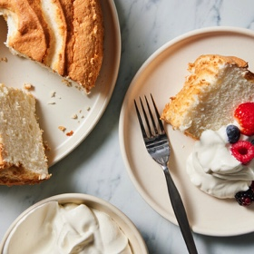

# [Angel Food Cake](https://cooking.nytimes.com/recipes/1024743-angel-food-cake)
> **tags**: #Dessert #Steph #0star

## Description

## Ingredients

- 1 cup/112 grams cake flour
- 1 1/2 cups/285 grams superfine sugar (see Tip 1)
- 1 1/2 cups/about 335 grams egg whites, at room temperature (from about 10 or 11 eggs; see Tip 2)
- 1 1/2 teaspoons cream of tartar
- 1/2 teaspoon kosher salt (such as Diamond Crystal)
- 1 1/2 teaspoon vanilla extract
- Whipped cream, for serving
- Fresh berries, for serving

## Directions
Heat the oven to 325 degrees with the rack in the center position. Sift the flour and ¾ cup (143 grams) of the sugar into a medium bowl six times; this ensures there are no lumps and the dry ingredients are very airy. (For extra assurance, you can also pulse these ingredients in a food processor a few times and then sift once.) 

In the bowl of a stand mixer fitted with the whisk attachment, combine the egg whites, cream of tartar and salt. Whisk on medium-low until the egg whites start to get foamy around the sides of the bowl, about 2 minutes. 

Increase the speed to medium-high. Add the remaining sugar, 1 tablespoon at a time, in a slow and steady stream. Continue whisking until the mixture reaches glossy and firm peaks, about 5 minutes, checking regularly so you don’t overbeat. Add the vanilla and quickly whisk to combine. 

In three batches, sift the dry ingredients over the top of the egg whites, using a spatula to fold the dry ingredients in between each batch until just incorporated. Be mindful not to overmix so the egg whites don’t collapse. 

Transfer half of the batter into the tube pan (do not grease or flour) and gently spread it out evenly with an offset spatula. Using a butter knife or a chopstick, swirl the batter around a few times to break up any air bubbles. Repeat with the remaining batter.

Bake until golden brown and a toothpick inserted comes out clean, 35 to 40 minutes. Turn the cake upside down and cool completely, about 1 hour. If your tube pan doesn’t have feet, turn it upside down and place the center hole over a wine bottle. 

Once cool, turn the cake right side up and, using a sawing motion, run a butter knife along the outside and inside edges of the cake a few times to loosen it. If your pan has a removable center, take it out and run the butter knife under the cake to release it. Using two wide spatulas, lift the cake up and out of the center stand, or release it onto a board, using your hands to guide it, then invert it right side up onto a cake stand or platter. (If your pan doesn’t have a removable center, carefully invert the whole pan.) 

Slice the cake with a serrated knife. Serve with whipped cream and berries. Cover cake with plastic wrap for up to 2 days at room temperature or up to 3 days in the fridge. It can also be frozen for up to 3 months.

## Notes
Tip 1: Superfine sugar, also called baker’s sugar, can be found in many grocery stores or online. As a substitute, blitz 285 grams granulated sugar in the food processor until very fine. If you don’t have a scale, blitz 1½ cups granulated sugar and measure out 1 cup for the cake. Reserve any remaining superfine sugar for stirring into iced tea or coffee.

Tip 2: Use the leftover yolks to make ice cream, lemon curd, pastry cream or aioli.

## Data
**prep** 10 min | **cook** 1 hr 55 min | **total** 2 hr | **serves** 10 servings