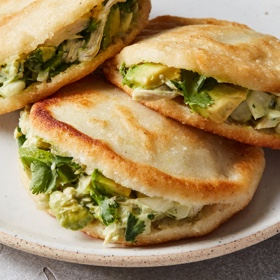

# [Arepas](https://cooking.nytimes.com/recipes/1024438-arepas)
> **tags**: #Mexican #3star

## Description

## Ingredients

- 2 cups/300 grams precooked white cornmeal (such as P.A.N.)
- 2 tablespoons vegetable oil, plus more for cooking arepas, if needed
- salt
- 1 ripe avocado, peeled, pitted and quartered
- 1/4 cup mayonnaise
- 1/2 medium white onion, chopped
- 1 garlic clove, finely chopped
- 1 tablespoon fresh lime juice, plus more to taste
- 2 medium chicken breasts from a rotisserie or roast chicken, shredded, skin and bones removed (about 2 cups)
- 1/2 cup cilantro leaves and tender stems, chopped

## Directions
Stir together cornmeal, 2 1/2 cups water, 1 tablespoon oil and 1 teaspoon salt in a large bowl until completely combined and no clumps of dry cornmeal remain. Continue stirring for 2 minutes. (Cornmeal will hydrate, making the dough thicker and slightly less sticky.) Cover with a clean, dry kitchen towel and let rest, covered, for 5 minutes.

Divide dough into 8 portions, then roll into balls and place on a sheet pan. Sprinkle a few drops of water on your hands to prevent the dough from sticking; pat and flatten each ball into a disk that is 1/2-inch thick and 4 to 4 1/2 inches in diameter.

Heat the remaining 1 tablespoon of oil in a large (12-inch) skillet, preferably cast-iron, over medium heat and cook 3 or 4 of the arepas until they are lightly browned in spots, about 5 minutes per side. Repeat with remaining arepas, adding more oil if necessary.

Insert a paring knife into the edge of the warm arepa and hollow out a pocket, slicing about halfway down and leaving the bottom edge intact similar to a pita. (They will be slightly gummy.) Repeat with the remaining arepas.

Place three-quarters of the avocado into a large bowl and smash with the tines of a fork until it is spreadable yet chunky. Add mayonnaise, onion, garlic, lime juice and 1 teaspoon salt, vigorously stirring until completely combined. Stir in chicken and cilantro until combined, adding more lime juice and salt, if desired. Thinly slice remaining avocado.

Stuff the arepas with a heaping 1/3 cup of the filling and a few slices of avocado and serve.

## Notes

## Data
**prep** 10 min | **cook** 50 min | **total** 1 hr | **serves** 8 arepas