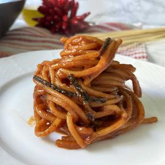

# [Authentic Spaghetti Allassassina](https://www.recipesfromitaly.com/authentic-spaghetti-allassassina-recipe/)
> **tags**: #Italian #0star

## Description

## Ingredients

- 350 g spaghetti 3/4 pound
- 150 g tomato passata 3/4 cup
- 1 tube tomato paste ~130 g/ ~4 oz
- 2 cloves garlic
- 3 chili peppers fresh
- 100 ml olive oil ~1/2 cup, extra virgin
- 1.5 liters water ~6 cups
- 1 tablespoon salt coarse
- salt to taste

## Directions
To prepare the spaghetti all'assassina as first thing, prepare the broth. Dissolve the tomato paste and coarse salt in plenty of water and bring to a boil. The broth should be bright red and flavorful.

In an iron skillet about 14 inches (36 cm) in diameter, sauté the EVO oil, the whole skinless garlic cloves, and the minced chilies over medium heat. When the garlic begins to color, add the tomato passata. Stir and adjust salt to taste.

PLEASE NOTE: The amount of chilies used depends on personal taste, size and hotness of the chilies. The traditional recipe calls for 3 chiles, 2 chopped and 1 whole, which you then remove.

At this point, add the whole raw spaghetti to the skillet. Stir them lightly with a wooden spoon so that they are evenly distributed on the bottom of the pan. Cook the spaghetti in the oil and passata. The spaghetti should be browned and stick to the bottom of the pan. Do not be in a hurry or afraid of making a mistake.

When the side of the spaghetti in contact with the pan is nicely toasted and caramelized (a little burnt), turn it over on the other side so that the toasting is as even as possible. Remove the garlic cloves and chili pepper, if you left it whole, and turn up the heat.

Now add a little broth at a time as the pasta absorbs it. Be careful not to pour the broth directly on the spaghetti, but rather on the sides of the pan so as not to "drown" the pasta.

Before flipping the spaghetti, wait for the broth to dry a bit, let the spaghetti toast well, then wait another 10 seconds and flip the spaghetti. This procedure requires a lot of coolness and calmness. Don't be in a hurry to turn the spaghetti, which will "suffer" in this way of cooking, hence the name "spaghetti all'assassina"!

When the spaghetti have absorbed all the broth, add another cup. Turn the spaghetti so that the part that was on top is underneath. Continue this process for about 8 to 10 minutes and the spaghetti should be done. Of course, some spaghetti will be softer than others.

Be careful not to move the spaghetti too much so as not to break them. Of course, you do not want them to burn completely. The key is to get the spaghetti to stick to the pan evenly so that they get a crispy texture and brown color.

## Notes

## Data
**prep** 5 min | **cook** 20 min | **total**  | **serves** Servings: 4