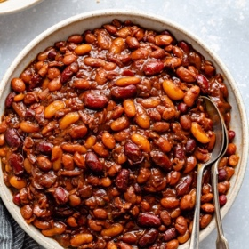

# [Baked Beans](https://www.ambitiouskitchen.com/slow-cooker-baked-beans/)
> **tags**: #Beans #Charlie #Untested #0star

## Description

## Ingredients

- 8 ounces bacon, diced
- 1 onion, diced
- 3 cloves garlic
- 1 (15 ounce) can pinto beans, rinsed and drained
- 1 (15 ounce) can kidney beans, rinsed and drained
- 1 (15 ounce) can northern white beans, rinsed and drained
- 1/2 cup ketchup
- 1/4 cup molasses
- 1/4 cup spicy bbq sauce (or your favorite bbq sauce -- use a sweet one if you like sweeter baked beans)
- 1/2 cup dark brown sugar (or sub coconut sugar)
- 1 tablespoon worcestershire sauce
- 1/2 tablespoon mustard (or sub dijon)

## Directions
Cook your bacon: add diced bacon to a large skillet or pan and place over medium heat, cook bacon until crispy and golden brown. If the pan starts to smoke at any point, simply lower the heat. I always cook my bacon on medium low heat. Once bacon is done, blot with a paper towel to absorb excess grease. Allow bacon to cool.

Drain the bacon grease, leaving a little on the bottom of the pan and add in the diced onion, cooking for 5-8 minutes or until they are slightly golden. During the last minute of cooking, add in your garlic and cook for 1 min. Remove from heat and set aside.

Add the drained and rinsed pinto, kidney and northern beans to the slow cooker, then add in the bacon and onion/garlic. Next add in the ketchup, molasses, bbq sauce, brown sugar, worcestershire and yellow mustard. Stir with a wooden spoon until everything is well combined. Cook on high for 3-4 hours or low for 6-7 hours.

## Notes

## Data
**prep** 30 mins | **cook** 3 hours | **total**  | **serves** 10