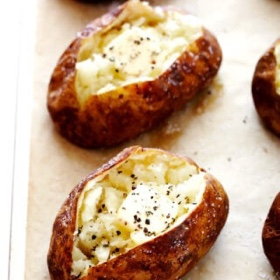

# [Baked Potato](https://www.gimmesomeoven.com/baked-potato/)
> **tags**: #Easy #Potato #0star

## Description

## Ingredients

- 1 medium-to-large Russet potato, scrubbed clean of any dirt
- 1–2 teaspoons melted butter (or olive oil)
- salt
- black pepper

## Directions
Heat the oven. Heat oven to 450°F. Line a large baking sheet with foil (or parchment*), and if you happen to own a wire cooling rack, place it on top of the baking sheet.

Prep the potato. Using a dinner fork or a small paring knife, poke the potato at least 10 times on all sides. Place the potato on the prepared baking sheet.

Bake (round one). Bake for 25 minutes. Remove baking sheet from the oven.

Brush with butter (or oil). Using a pastry brush, brush the outside of the potato with melted butter or olive oil until it is completely coated on all sides. Sprinkle the potato with a generous pinch of Kosher salt, and place the potato back on the baking sheet reverse-side-up, so that it can cook evenly on both sides.

Bake (round two). Bake for an additional 20 minutes. Using an oven mitt, carefully squeeze the potato to check for doneness. If the insides are soft and give under pressure, remove the potato from the oven. Otherwise, continue cooking in 5-minute increments until the potato is soft.

Cut the potato. Using a small paring knife, slice halfway through the potato lengthwise. Then give it a gentle squeeze to open.

Serve. Serve immediately, with your desired toppings.

## Notes

## Data
**prep** 2 minutes | **cook** 50 minutes | **total**  | **serves** Yield: 1 serving