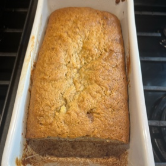

# Banana Bread
> **tags**: #Easy #Quick Bread #Sides #Vegetarian #5star

## Description
Banana Bread Recipe

The best bananas to use for banana bread are those that are over-ripe. The yellow peels should be at least half browned, and the bananas inside squishy and browning.

## Ingredients

- • 3 very ripe bananas, peeled
- • 1/3 cup melted butter
- • 1 cup of sugar (can easily use 3/4 cup if you want it less sweet)
- • 1 egg, beaten
- • 1 teaspoon vanilla extract
- • 1 teaspoon baking soda
- • Pinch of salt
- • 1 1/2 cups of all-purpose flour
- • 1 cup of pecans

## Directions
Preheat the oven to 350°F (175°C), and butter a 4x8-inch loaf pan.

In a mixing bowl, mash the ripe bananas with a fork until smooth. Stir the melted butter into the mashed bananas.

Mix in the baking soda and salt. Stir in the sugar, beaten egg, and vanilla extract. Mix in the flour.  

Add the nuts

Mix well.  

Pour the batter into your prepared loaf pan. Bake for 1 hour to 1 hour 10 minutes (check at 50 minutes) at 350°F (175°C), or until a tester inserted into the center comes out clean.

Remove from oven and cool completely on a rack. Remove the banana bread from the pan. Slice and serve. (A bread knife helps to make slices that aren't crumbly.)

## Notes

## Data
**prep**  | **cook**  | **total**  | **serves** 