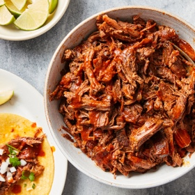

# [Barbacoa](https://cooking.nytimes.com/recipes/1024435-barbacoa)
> **tags**: #Mexican #To Try #0star

## Description

## Ingredients

- 2 tablespoons lard or vegetable oil
- 1/2 onion, chopped
- 8 garlic cloves, peeled and crushed
- 2 large guajillo or dried New Mexican or Californian chiles (about 25 grams), stemmed, seeded and torn into 1-inch pieces
- 1 to 2 morita chiles (5 to 10 grams), stemmed, or chopped chipotles en adobo, to taste
- 3 bay leaves
- 1 teaspoon dried thyme, or 2 teaspoons fresh
- 1 teaspoon dried oregano, preferably Mexican, or dried marjoram
- 1 teaspoon whole black peppercorns
- 1/2 teaspoon cumin seed
- 4 teaspoons salt
- 4 1/2 pounds chuck roast, trimmed of excess fat
- Warm corn tortillas, chopped onion, chopped cilantro, lime wedges and salsa, for serving (optional)

## Directions
Heat oven to 275 degrees. Heat lard in a large, heavy-bottom pot or Dutch oven over medium and add onion and garlic, stirring occasionally, until just tender and beginning to brown, 5 to 7 minutes. Add guajillo and morita chiles, stirring occasionally, until beginning to darken and moritas are slightly puffed, about 90 seconds. Add bay leaves, thyme, oregano, peppercorns and cumin seeds and cook, stirring frequently, until fragrant, 60 to 90 seconds.

Stir 3/4 cup water and salt into the pot, then arrange beef on top. Bring to a boil, cover and transfer to the oven. Roast until beef is very tender and it shreds easily, 3 1⁄2 to 4 hours. Let cool for 15 minutes, then transfer beef to a large bowl and, using a potato masher or 2 large forks, smash or pull beef until completely shredded.

Skim fat from the chile liquid in the pot. Transfer chile mixture and the liquid to a blender and process until smooth, adding a few splashes of water if mixture is very thick and difficult to blend. Transfer blended mixture to the bowl of shredded beef (or return everything to the pot) and stir until completely coated. Taste and season with salt, if necessary.

Serve barbacoa with warm tortillas, onion, cilantro, lime wedges and salsa, if desired.

## Notes
Barbacoa can be made 3 days ahead. Store refrigerated in an airtight container.

## Data
**prep** 10 min | **cook** 4 hr 15 min | **total** 4 hr 25 min | **serves** 8 servings