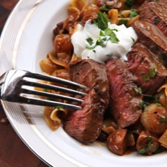

# [Beef Stroganoff, Ultimate](https://www.seriouseats.com/ultimate-beef-stroganof-recipe)
> **tags**: #To Try #0star

## Description

## Ingredients

- 2 (0.25 ounce) packets unflavored powdered gelatin (about 5 teaspoons)
- 2 cups (475ml) homemade or store-bought low-sodium chicken stock
- Kosher salt and freshly ground black pepper
- 2 tablespoons (6g) mild paprika
- 4 (1 1/2- to 2-inch thick) beef tenderloin steaks, 6 to 8 ounces each (see note)
- 3 tablespoons (45ml) canola or vegetable oil
- 12 ounces (340g) button mushrooms, quartered
- 8 ounces (225g) peeled pearl onions (about 24 onions, see note)
- 3 tablespoons (45g) unsalted butter, divided
- 1 medium shallot, thinly sliced (about 1/4 cup)
- 4 sprigs fresh thyme
- 1 teaspoon soy sauce
- 2 teaspoons Worcestershire sauce
- 1 teaspoon Asian fish sauce
- 2 teaspoons Dijon mustard
- 1 cup (235ml) dry white wine
- 1 cup (225g) sour cream, plus more for serving
- 1 pound (455g) dried egg noodles
- 1/4 cup (20g) minced fresh parsley leaves

## Directions
Sprinkle gelatin over chicken stock in a small bowl or liquid measuring cup. Set aside. Bring a large pot of salted water to a boil.

Combine 1 tablespoon salt, 1 teaspoon pepper, and half of paprika in a small bowl. Season steaks generously on all sides with mixture (you may not need all the mixture) and press with the flat of your hand to adhere. Heat half of vegetable oil in a large skillet or sauté pan over high heat until lightly smoking. Add meat and cook, turning occasionally, until well-browned on both sides and center of steaks register 115°F (46°C) at the thickest part for rare or 125°F (52°C) for medium-rare. Remove from pan, transfer to a plate, and set aside.

Add remaining vegetable oil to the same pan and add the mushrooms. Return to medium heat and cook, stirring and tossing frequently, until mushrooms have released their liquid and are just starting to brown, about 8 minutes. Add 1 tablespoon butter and pearl onions and continue to cook, stirring, until onions and mushrooms are softened and well-browned, about 6 minutes longer.

Add shallots, thyme, and remaining paprika, and cook, stirring, until fragrant. Add soy sauce, Worcestershire sauce, fish sauce, and mustard and cook, stirring, until mostly evaporated, about 30 seconds. Add any collected juices from the plate with the meat, followed by white wine. Cook until reduced to just a few tablespoons.

Add broth/gelatin mixture and bring to a heavy simmer. Carefully pour off liquid into a heatproof cup or liquid measuring cup. Add sour cream to a medium bowl. Whisking constantly, slowly pour hot liquid over sour cream and whisk until fully homogeneous.

Return sour cream mixture to pan along with remaining 2 tablespoons butter. Bring to a boil over medium-high heat and season to taste with salt and pepper. Return steaks to pan until barely warmed through, about 1 minute. Remove from heat.

Cook noodles according to package directions. When cooked, drain and return to pot, reserving 1 cup of pasta cooking water. Transfer steaks to a cutting board and pour the sauce, mushrooms, and onions over the noodles. Stir to coat pasta, adding pasta cooking water as necessary until it reaches a loose, creamy consistency. Stir in half of minced parsley.

Thinly slice steaks. To serve, divide pasta and cream sauce evenly between 4 hot serving bowls. Top with sliced steak, spooning a little extra sauce over them. Add a dollop of sour cream, sprinkle with remaining parsley, and serve, advising guests to remove large thyme sprigs as they find them.

## Notes
Any tender steak cut can be used in place of tenderloin. I recommend hanger steaks or flap meat (sometimes labeled sirloin tip in the Northeast). If using an alternative steak cut, I advise cooking to medium-rare instead of rare.

Frozen pearl onions can be used in place of fresh, though fresh will have better flavor and texture. Peel pearl onions by trimming the ends, cutting a small X into the ends of each one, submerging in boiling water for 30 seconds, and peeling under cold running water. The skins will slip right off. Watch this video for details.

## Data
**prep** 10 mins | **cook** 45 mins | **total**  | **serves** 4 servings