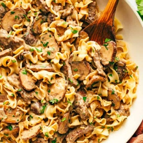

# [Beef Stroganoff](https://www.gimmesomeoven.com/easy-beef-stroganoff-recipe/)
> **tags**: #Mains #4star

## Description

## Ingredients

- 1 pound farafelle or uncooked wide egg noodle
- 1/4 cup butter, divided
- 1 1/2 pounds thinly-sliced steak (I recommend flank steak)
- salt
- black pepper
- 1 small white onion, thinly sliced
- 1 pound sliced mushrooms (I used a mix of button and baby bella mushrooms)
- 4 cloves garlic, minced or pressed
- 1/2 cup dry white wine*
- 1 1/2 cups stock
- 1 tablespoon worcestershire sauce
- 3 tablespoons flour
- 1/2 cup Greek yogurt
- chopped fresh parsley (optional)

## Directions
Cook the noodles: Cook egg noodles in a large stockpot of generously-salted water until they are al dente, according to package instructions, then drain. (For optimal timing, I recommend adding the egg noodles to the boiling water at the same time that you begin Step 4, listed below.)

Sauté the steak: Meanwhile, as your pasta water is coming to a boil, melt 2 tablespoons of the butter in a large sauté pan over medium-high heat. Add the steak in a single layer, seasoned with a few generous pinches of salt and pepper, and let it cook undisturbed for about 3 minutes to get a good sear. Flip the steak, and cook on the other side until browned, another 2-3 minutes. Then remove steak from pan with a slotted spoon, transfer to a clean plate, and set aside. (If your pan is not big enough to fit all of the steak in a single layer, cook half of the steak in 1 tablespoon of butter. Then repeat with a second batch.)

Sauté the veggies: Add the remaining 2 tablespoons butter to the sauté pan. Once it has melted, add the onions and sauté for about 3 minutes. Add mushrooms and sauté for an additional 5-7 minutes, stirring occasionally, or until the mushrooms are cooked and the onions are soft. Add the garlic and sauté for 1 minute, stirring occasionally. Then add the white wine and deglaze the pan by using your cooking spoon to scrape the brown bits off the bottom of the pan. Let the mixture cook down for an additional 3 minutes.

Finish the sauce: While the wine cooks down, whisk together the beef stock, Worcestershire sauce and flour until smooth in a separate bowl. Pour the beef stock mixture into the sauté pan, stir to combine, then let the mixture simmer for 5 minutes, stirring occasionally. Stir in the Greek yogurt (or sour cream) and cooked steak until combined. Taste and season with additional salt and pepper if needed.

Serve: Serve warm over egg noodles, garnished with a sprinkle of parsley and an extra twist of black pepper, if desired.

## Notes

## Data
**prep** 5 minutes | **cook** 25 minutes | **total**  | **serves** Yield: 4-6 servings