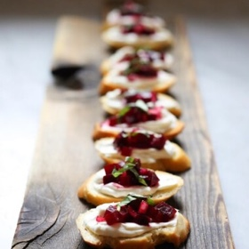

# [Beet Bruschetta with Goat Cheese and Basil](https://www.feastingathome.com/beet-bruschetta-with-goat-cheese-and-basil/)
> **tags**: #Vegetarian #0star

## Description

## Ingredients

- 3 medium beets, (tennis ball sized) halved
- 1 baguette
- Olive oil
- 1 tablespoon balsamic vinegar
- 10 basil leaves – cut into ribbons
- 1/8 cup finely diced red onion or shallot
- 4 oz goat cheese
- 4 oz cream cheese
- 1/4 teaspoon salt
- 1/4 teaspoon black pepper
- 1/2 teaspoon maple syrup or sugar

## Directions
Preheat oven to 400F

In a medium put, cover halved beets with water and boil until just tender, about 20-30 minutes.

In the meantime, slice baguette at a diagonal. Brush both sides with olive oil, sprinkle with a little salt and place on a sheet pan in a 400 F oven for 15-20 minutes, or until crisp and golden. Set aside.

Place cream cheese and goat cheese in a bowl and warm in a microwave until just soft enough to combine easily with a fork (20 seconds). ( I place the bowl in my toaster oven on low). Mix with a fork until smooth. Season with salt and pepper. Feel free to add some fresh chopped herbs ( basil or parsley) Set aside.

When beets are fork-tender, drain pot, refill with cold water and slip skins off the cooked beets under running cold water using your hands. Dice into very small 1/3-inch cubes and place in medium bowl.

Add finely chopped onion, salt, pepper, maple, olive oil and balsamic -stir to combine. Taste, adjusting. You want this be flavorful and juicy.

Assemble: Spread a little goat cheese mixture on each bruschetta creating a “trough” ( to hold beet mixture in place) and top with a Tablespoon of beet mixture. Garnish with a few basil ribbons. It’s really nice to serve when the goat cheese is still a touch warm. Serve on a white platter to show it off, or a rustic cutting board.

## Notes
You can make all components ahead. Store beet relish and cheese mixture in the fridge. Store bruschetta on the counter, uncovered, resisting the urge to snack. 🙂

Assemble right before guests arrive, warming the cheese mixture just slightly so it’s spreadable – either in microwave, or in oven. Or leave it out on the counter for a couple hours beforehand to warm to room temp.

## Data
**prep** 20 mins | **cook** 30 mins | **total**  | **serves** Yield: 24 bruschetta