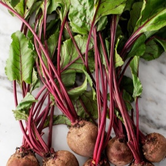

# [Beet Salad with Goat Cheese and Balsamic](https://www.loveandlemons.com/beet-salad-recipe/)
> **tags**: #Lunch #Salad #5star

## Description

## Ingredients

- 4 to 5 beets
- olive oil
- 2 cups salad greens, arugula or spring mix
- 1/2 shallot, thinly sliced
- 2 ounces goat cheese, torn
- Balsamic Vinaigrette
- salt
- black pepper

## Directions
Preheat the oven to 400°F.

Wrap each beet in a piece of aluminum foil and drizzle generously with olive oil and pinches of salt and pepper. Place the beets on a baking sheet and roast for 40 to 90 minutes, or until soft and fork-tender. The time will depend on the size and freshness of the beets. Remove the beets from the oven, remove the foil, and set aside to cool. When they are cool to the touch, peel the skins. I like to hold them under running water and slide the skins off with my hands.

Let the beets cool and chill them in the fridge until ready to use.

Slice the beets into ¼-inch-thick rounds. Assemble the salad with the greens, shallots, apples, beets, walnuts, cheese, and microgreens, if using. Drizzle with balsamic vinaigrette. Season with flaky sea salt and pepper and serve.

## Notes

## Data
**prep** 15 mins | **cook** 1 hr | **total**  | **serves** Serves 4