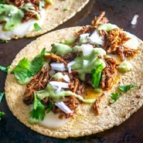

# [Birria De Res](https://www.mexicanplease.com/birria-de-res-recipe-beef-birria/)
> **tags**: #Mexican #0star

## Description

## Ingredients

- 3 lbs. beef brisket or chuck roast
- 4-5 Roma tomatoes
- 1 onion
- 6 garlic cloves
- 3-4 Ancho dried chiles
- 2-3 New Mexican dried chiles
- 2 chipotles in adobo (optional)
- 1-2 tablespoons adobo sauce (from the can, optional)
- 2 cups stock
- 1 teaspoon cumin
- 2 teaspoons Mexican oregano
- 1/8 teaspoon cinnamon
- pinch of ground clove
- 2 teaspoons salt (plus more to taste)
- freshly cracked black pepper
- olive oil

### For the tacos (optional)
- corn tortillas
- Salsa de Aguacate
- finely chopped raw onion
- cilantro
- squeeze of lime

## Directions
Start by rinsing and de-stemming the tomatoes. Roast them in a 400F oven for 20-25 minutes or until you need them.

Wipe off any dusty crevasses on the dried chiles. De-stem and de-seed the chiles, but don't worry about getting rid of every last seed. Roast them in the oven for 1-2 minutes or until warm and fragrant. Add the chile pieces to a bowl and cover them with the hottest tap water you've got. Let them reconstitute for 20 minutes or so.

Roughly chop 1 onion and peel 6 garlic cloves. Add a glug of oil to a skillet on medium heat and saute the onions and whole garlic cloves. Once the onion has softened and lightly browned you can add this mixture to the blender.

Add a thin layer of oil to a skillet and preheat to medium-high. Chop up the brisket into chunks and give it a good salting. Sear each side of the beef in the skillet for a few minutes or until it is browning. Add the seared meat pieces to the slow cooker. You can optionally deglaze the pan with the 2 cups of stock that's used to liquefy the sauce.

Before draining the reconstituted chiles take a taste of the soaking liquid. If it tastes bitter to you then use stock for the sauce. If you like the flavor you are welcome to use the soaking liquid in place of the stock.

Add the drained chiles, roasted tomatoes, and the onion-garlic mixture to a blender along with: 2 cups of stock (or what you used to deglaze the meat pan), 2 chipotles in adobo (optional), 1-2 tablespoons adobo sauce from the can (optional), 1 teaspoon cumin, 2 teaspoons Mexican oregano, 1/8 teaspoon cinnamon, pinch of ground clove, 2 teaspoons salt, and some freshly cracked black pepper. Combine well. Note: if you're using stock that's high in sodium you can consider starting with a single teaspoon of salt and going from there.

Take a taste of the sauce. An easy to way to add more heat is to add an additional half or whole chipotle. Keep in mind that the sauce has to compete with the big flavor of the beef so I tend to make it salty and fiery at this point.

Cover the seared meat pieces with the sauce. Slow cook on low for 4-6 hours.

Once cooked you can optionally skim off any fat that has risen to the surface. Shred the beef using two forks and discard any fatty chunks that you don't want to eat.

Add the shredded beef (or as much as you are using for tonight's meal) to a separate bowl and add enough sauce to give it a thorough coating. Adding the sauce to the shredded beef is the key so don't skip this step!

One serving option is to simply add the shredded beef back to the sauce and serve it soup style -- you may need to thin out the sauce with some stock if you choose this option.

But I chose tacos for this batch. Add corn tortillas to a dry skillet over medium heat along with slices of cheese. Once the cheese is melted and the underside of the tortillas are forming light brown spots they are ready to go. You can optionally add the meat to the tortillas in the skillet for a quick reheat.

I topped these tacos with Salsa de Aguacate, finely chopped raw onion, freshly chopped cilantro, and a squeeze of lime.

Store leftover Birria in the fridge where it will keep for a few days.

## Notes
If you don't want to use a slow cooker you can simmer this recipe on the stove for a few hours (covered) and get an equally good result.

Feel free to get creative with the dried chiles as there is tons of leeway on this. In other words, if you use what you have available (plus some heat) then most likely you'll be happy with the result.

For a milder batch, you can use only 1 chipotle in adobo or omit them.

Be sure to take a taste of the chiles' soaking liquid. If it tastes bitter to you then use stock for the sauce. If you like the flavor you are welcome to use the soaking liquid in place of the stock.

## Data
**prep** 30 min | **cook** 6 hr | **total**  | **serves** 8