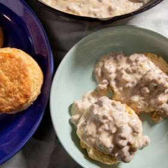

# [Biscuits and Gravy](https://www.seriouseats.com/biscuits-and-gravy-recipe-7369656)
> **tags**: #Breakfast #4star

## Description

## Ingredients

- 1 pound (454g) pork breakfast sausage, casings removed
- 2 tablespoons (28g) unsalted butter, as needed
- 1 medium yellow onion (about 8 ounces; 227g), finely diced
- Kosher salt
- 3 tablespoons (24g) all-purpose flour
- 3 cups (710ml) whole milk
- Freshly ground black pepper
- One batch of buttermilk biscuits, split (see notes)

## Directions
In a 10-inch cast iron skillet set over medium-high heat, sauté the sausage, breaking it up with a wooden spoon, until at least 1 1/2 tablespoons fat has rendered, about 6 minutes; if your sausage is lean and yields less than 1 1/2 tablespoons of fat, melt in butter, 1/2 tablespoon at a time, until you have about 1 1/2 tablespoons in the skillet. Add the onion, season with a pinch of salt, and cook, stirring occasionally, until onion is very soft and golden and the sausage is well browned, about 7 minutes longer.

Stir in the flour until no dry bits remain, about 30 seconds.

Stir in 2 tablespoons of milk until completely absorbed. Gradually pour in remaining milk while stirring constantly to avoid lumps. Bring the gravy to a simmer and cook, stirring and scraping the sides and bottom of the skillet, until a silky and thick, spoon-coating sauce forms, about 4 minutes. Season to taste with salt and a generous amount of black pepper.

Serve warm biscuits with hot gravy spooned over top.

## Notes
Basically a roux, need to use breakfast sausage

## Data
**prep** 10 mins | **cook** 20 mins | **total**  | **serves** 4