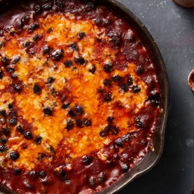

# [Black Bean Bake](https://cooking.nytimes.com/recipes/1020705-cheesy-spicy-black-bean-bake)
> **tags**: #Beans #0star

## Description

## Ingredients

- 3 tablespoons extra-virgin olive oil
- 5 garlic cloves, peeled and sliced
- 1/4 cup tomato paste
- 1 1/2 teaspoons paprika
- 1/4 teaspoon red-pepper flakes
- 1 teaspoon ground cumin
- 2 (14-ounce) cans black beans, drained and rinsed
- 1/2 cup boiling water
- salt
- black pepper
- 1 1/2 cups grated Cheddar or Manchego cheese (from about a 6-ounce block)

## Directions
Heat the oven to 475 degrees. In a 10-inch ovenproof skillet, heat the olive oil over medium-high. Fry the garlic until lightly golden, about 1 minute. Stir in the tomato paste, paprika, red-pepper flakes and cumin (be careful of splattering), and fry for 30 seconds, reducing the heat as needed to prevent the garlic from burning.

Add the beans, water and generous pinches of salt and pepper, and stir to combine. Sprinkle the cheese evenly over the top then bake until the cheese has melted, 5 to 10 minutes. If the top is not as browned as you’d like, run the skillet under the broiler for 1 or 2 minutes. Serve immediately.

## Notes

## Data
**prep**  | **cook** 15 min | **total** 15 min | **serves** 4 servings