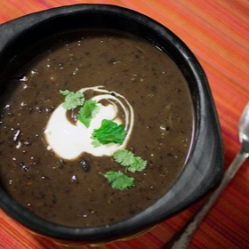

# [Black Bean Soup, 30-minute](https://www.seriouseats.com/30-minute-black-bean-soup-recipe)
> **tags**: #To Try #0star

## Description

## Ingredients

- 1 tablespoon vegetable oil
- 2 green bell peppers, stems and seeds discarded, finely diced
- 1 large onion, finely diced
- 2 cloves garlic, minced on a Microplane grater
- 1 jalapeño or serrano pepper, stems and seeds discarded, finely chopped
- 1 teaspoon ground cumin
- 1/2 teaspoon dried chile flakes
- 1 chipotle chile packed in adobo, finely chopped, plus 1 tablespoon adobo sauce from can (optional)
- 1 quart homemade or low-sodium canned chicken broth
- 2 (15-ounce) cans black beans, with liquid
- 2 bay leaves
- Kosher salt

### To Serve (all optional)
- Roughly chopped cilantro leaves
- Mexican-style sour cream
- Diced avocado
- Diced red onion

## Directions
Heat vegetable oil in a large saucepan over medium-high heat until shimmering. Add peppers and onions and cook, stirring frequently, until softened but not browned, about 3 minutes. Add garlic, jalapeño, cumin, and dried chili flakes and cook, stirring constantly until fragrant, about 1 minute. Add chipotle and adobo sauce (if using) and stir to combine. Add chicken broth, beans and their liquid, and bay leaves. Increase heat to high, and bring to a boil. Reduce to a bare simmer, cover and cook for 15 minutes.

Discard the bay leaves. Use a hand blender to roughly puree part of the beans until desired consistency is reached. Alternatively, transfer 2 cups of soup to a blender or food processor and process until smooth (start on low speed and increase to high to prevent blender blow-out). Return to the soup and stir to combine. Season to taste with salt.

Ladle soup into individual serving bowls and serve immediately with cilantro leaves, sour cream, diced avocado, and diced red onion (as desired).

## Notes

## Data
**prep**  | **cook** 30 mins | **total**  | **serves** 4 to 6 servings