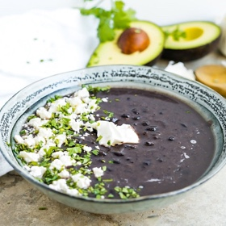

# [Black Bean Soup, Guatamalan Sopa De Frijol](https://www.atastefortravel.ca/17308-guatemalan-black-bean-soup/)
> **tags**: # #5star

## Description

## Ingredients

- 1 pound dried turtle beans
- 10 cups water
- 4 cloves garlic
- 1 onion medium
- Toppings
- 6 tablespoon sour cream or Mexican crema
- 6 tablespoon cilantro finely chopped
- 6 tablespoon Queso de Zacapa or Mexican cotija or feta crumbled

## Directions
Rinse the beans well. You don’t need to soak them overnight.

Simmer the beans with the garlic, onions and salt in water until tender but not mushy (about 1 ½ hours)

Remove the garlic cloves from the soup, reserving one clove. Puree half of the beans with the one clove of reserved garlic in a blender (or use an immersion blender) and add back into the pot.

Add more water if needed to reach desired consistency of soup.

Reheat until warm

Top each bowl with swirl of crema, the chopped cilantro and sprinkle of cotija (or feta) cheese.

Serve with a wedge of fresh lime and slices of avocado.

## Notes
Don’t be tempted to cut corners and use canned beans, the consistency and flavour of canned black beans are totally different and they contain more sodium.

One of the most popular variations of traditional Guatemalan Black Bean soup is the addition of chicharron - crispy fried pork rinds - into each bowl of soup prior to serving. This adds a burst of salty, smoky flavour that's really delicious.

For hearty version that's vegetarian my husband likes to whisk a large egg and pour it slowly into the pot of simmering soup. He swirls it around so it cooks in ribbons rather like a Guatemalan version of egg drop soup.

If you don't like cilantro (due to genetic reasons cilantro tastes like soap for some people), then you can substitute an equal amount of thinly sliced green onion.

## Data
**prep** 5 mins | **cook** 1 hr 30 mins | **total**  | **serves** Servings: 6