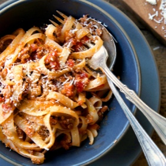

# [Bolognese Sauce, Marcella Hazan](https://cooking.nytimes.com/recipes/1015181-marcella-hazans-bolognese-sauce)
> **tags**: #Italian #5star

## Description

## Ingredients

- 1 tablespoon vegetable oil
- 3 tablespoons butter plus 1 tablespoon for tossing the pasta
- 1/2 cup chopped onion
- 2/3 cup chopped celery
- 2/3 cup chopped carrot
- 3/4 pound ground beef chuck (or you can use 1 part pork to 2 parts beef)
- Salt
- Black pepper, ground fresh from the mill
- 1 cup whole milk
- Whole nutmeg
- 1 cup dry white wine
- 1 1/2 cups canned imported Italian plum tomatoes, cut up, with their juice
- 1 1/4 to 1 1/2 pounds pasta
- Freshly grated parmigiano-reggiano cheese at the table

## Directions
Put the oil, butter and chopped onion in the pot and turn the heat on to medium. Cook and stir the onion until it has become translucent, then add the chopped celery and carrot. Cook for about 2 minutes, stirring vegetables to coat them well.

Add ground beef, a large pinch of salt and a few grindings of pepper. Crumble the meat with a fork, stir well and cook until the beef has lost its raw, red color.

Add milk and let it simmer gently, stirring frequently, until it has bubbled away completely. Add a tiny grating -- about 1/8 teaspoon -- of nutmeg, and stir.

Add the wine, let it simmer until it has evaporated, then add the tomatoes and stir thoroughly to coat all ingredients well. When the tomatoes begin to bubble, turn the heat down so that the sauce cooks at the laziest of simmers, with just an intermittent bubble breaking through to the surface. Cook, uncovered, for 3 hours or more, stirring from time to time. While the sauce is cooking, you are likely to find that it begins to dry out and the fat separates from the meat. To keep it from sticking, add 1/2 cup of water whenever necessary. At the end, however, no water at all must be left and the fat must separate from the sauce. Taste and correct for salt.

Toss with cooked drained pasta, adding the tablespoon of butter, and serve with freshly grated Parmesan on the side.

## Notes

## Data
**prep**  | **cook** 4 hr | **total** 4 hr | **serves** 2 heaping cups, for about 6 servings and 1 1/2 pounds pasta