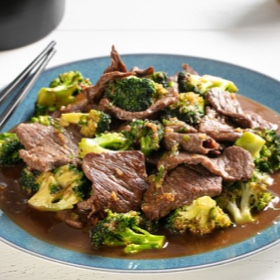

# [Broccoli Beef with Oyster Sauce](https://www.seriouseats.com/chinese-american-beef-and-broccoli-with-oyster-sauce-recipe)
> **tags**: #Asian #5star

## Description

## Ingredients

- 1 pound flank steak, skirt steak, hanger steak, or flap meat, cut into 1/4-inch thick strips
- 1/4 cup soy sauce (divided)
- 1/4 cup Shaoxing wine or dry sherry (divided)
- 2 teaspoons corn starch
- 1/3 cup low-sodium homemade or store-bought chicken stock
- 1/4 cup oyster sauce
- 1 tablespoon sugar
- 1 teaspoon sesame seed oil
- 2 medium cloves garlic, finely minced (about 2 teaspoons)
- 2 teaspoons finely minced fresh ginger
- 3 scallions, whites finely sliced, greens cut into 1/2-inch segments, reserved separately
- 4 tablespoons vegetable, peanut, or canola oil
- 1 pound broccoli florets (about 1 1/2 quarts)

## Directions
In a bowl, combine beef, 1 tablespoon soy sauce, and 1 tablespoon Shaoxing wine and toss to coat. Place in refrigerator and let marinate for at least 20 minutes and up to 3 hours.

Meanwhile, combine remaining soy sauce with cornstarch and stir with a fork to form a slurry. Add remaining Shaoxing wine, chicken stock, oyster sauce, sugar, and sesame oil. Set aside. Combine garlic, ginger, and scallion whites in a bowl and set aside.

To Grill With a Wok Insert: Light one chimney full of charcoal. When all the charcoal is lit and covered with gray ash, pour out and arrange the coals in a pile on center of cooking grate. Place Weber 8835 Gourmet BBQ System Hinged Cooking Grate on grill and set wok in center. Add oil and heat until smoking. Add beef and cook, stirring and tossing until beef is lightly charred but still pink in spots, about 1 minute. Push beef to sides of wok to clear space in center. Add broccoli and cook, stirring in center until lightly charred, about 30 seconds. Toss with beef and push up sides of wok. Add garlic/ginger/scallion mixture to center of wok and immediately push all ingredients into center, tossing and stirring until beef is cooked through and broccoli is just barely tender but still crunchy, about 30 seconds longer. Stir sauce and pour into wok (it should immediately start to boil). Add scallion greens. Toss all ingredients to coat in sauce and cook until lightly thickened, about 30 seconds. Carefully transfer to a serving platter and serve.

To Cook On A Burner: When ready to cook, heat 1 tablespoon oil in a wok over high heat until smoking. Add half of beef and cook without moving until well seared, about 1 minute. Continue cooking while stirring and tossing until lightly cooked but still pink in spots, about 1 minute. Transfer to a large bowl. Repeat with 1 more tablespoon of oil and remaining beef, adding beef to same bowl. Wipe out wok.

Add 1 more tablespoon oil to wok and heat over high heat until smoking. Add half of broccoli and cook until crisp-tender and lightly charred, about 1 minute. Transfer to bowl with beef. Repeat with remaining oil and remaining broccoli. Return wok to high heat until smoking. Return beef and broccoli to wok and add garlic/ginger/scallion mixture. Cook, tossing and stirring until fragrant, about 30 seconds. Add sauce and scallion greens and cook, tossing and stirring constantly until lightly thickened, about 45 seconds longer. Carefully transfer to a serving platter and serve.

## Notes
This recipe is the third in a four-part series about how to stir-fry on an outdoor grill.

## Data
**prep** 5 mins | **cook** 15 mins | **total**  | **serves** 4 servings