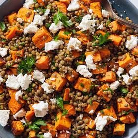

# [Brown Butter Lentil and Sweet Potato Salad](https://cooking.nytimes.com/recipes/1021511-brown-butter-lentil-and-sweet-potato-salad)
> **tags**: #Salad #0star

## Description

## Ingredients

- 1 pound sweet potatoes, butternut squash or carrots, peeled and cut into 3/4-inch pieces (about 4 cups)
- 2 tablespoons olive oil
- Kosher salt and black pepper
- 1 cup French green lentils or black lentils, rinsed
- 1/2 cup chopped fresh parsley leaves and tender stems
- 1/2 cup crumbled goat cheese (optional)
- 1 tablespoon minced fresh sage leaves
- 4 tablespoons unsalted butter
- 1 tablespoon extra-virgin olive oil
- 2 tablespoons red wine vinegar
- 1 teaspoon maple syrup
- Kosher salt and black pepper

## Directions
Heat the oven to 375 degrees and set a rack in the center.

Prepare the sweet potatoes: On a baking sheet, toss the sweet potatoes with the olive oil and a sprinkle of salt and pepper. Spread into an even layer and roast, stirring occasionally, until golden and tender, 15 to 25 minutes.

While the sweet potatoes cook, prepare the lentils: Add the lentils to a medium pot and cover with about 6 cups water. Salt the water generously and bring the mixture to a boil. Turn the heat down to a simmer and cook the lentils until just tender, 15 to 25 minutes. Drain the lentils then return them to the pot. Cover to keep warm.

Prepare the vinaigrette: Add the sage to a small bowl. Melt the butter in a small skillet set over medium heat. (Use a pan with a light interior so you can easily see the milk solids change color.) Cook the butter a few minutes, stirring occasionally and scraping the milk solids off the bottom and sides of the pan as needed, until the milk solids turn golden brown and smell toasty.

Pour the hot browned butter and all of the toasty bits over the sage; it will crackle and foam a bit. Let the mixture sit for 1 minute to let the foam subside, then whisk in the olive oil, followed by the red wine vinegar and maple syrup. Season with salt and pepper to taste.

Add the cooked sweet potatoes to the pot with the warm lentils. Pour the dressing over the top and stir gently to combine. Add the parsley, season with more salt and pepper, if desired, and toss to combine.

Transfer the mixture to a serving dish and sprinkle with goat cheese, if using. Serve warm.

## Notes

## Data
**prep**  | **cook**  | **total** 35 min | **serves** 4 to 6 servings