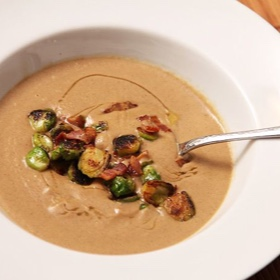

# [Brown Butter-Sunchoke Soup with Brussels Sprouts and Bacon](https://www.seriouseats.com/brown-butter-sunchoke-soup-recipe)
> **tags**: #Soup #To Try #0star

## Description

## Ingredients

- 6 tablespoons butter
- 2 pounds sunchokes (also sold as Jerusalem artichokes), skin-on, scrubbed, and cut into 1/2-inch disks
- 1 large leek, white and pale green parts only, split in half, washed and sliced into half-inch pieces
- 1 medium onion, finely sliced (about 1 cup)
- 2 medium cloves garlic, minced (about 2 teaspoons)
- 1/4 cup finely chopped fresh sage leaves
- 6 cups low-sodium homemade or store-bought chicken broth
- 2 bay leaves
- 1/4 pound bacon, cut into 1/2-inch pieces
- Kosher salt and freshly ground black pepper
- Dash sherry or white wine vinegar
- 1/2 pound Brussels sprouts, split in half

## Directions
Melt butter in a large Dutch oven over medium-high heat, swirling constantly until it is a deep brown and has a nutty aroma, about 1 1/2 minutes. Add sunchokes and stir. Cook, stirring occasionally, until sunchokes are well browned on all surfaces and starting to lightly char, about 10 minutes. Add leeks and onions and continue to cook, stirring occasionally, until softened, about 5 minutes longer. Add garlic and sage and cook, stirring constantly, until aromatic, about 1 minute. Add chicken stock and bay leaves. Bring to a boil, reduce to a simmer and cook until sunchokes are tender, about ten minutes. Discard bay leaves.

While soup simmers, place bacon in a large cast iron skillet over medium-high heat and cook, stirring occasionally, until brown and crisp, about 10 minutes. Transfer bacon to a bowl, leaving fat in the skillet. Set aside.

Working in batches, puree soup in a blender on high speed until completely smooth, about 2 minutes per batch. Transfer to a large saucepot, straining through a fine mesh strainer if a smoother soup is desired. When all batches are pureed, season to taste with salt and pepper. Whisk in vinegar, a teaspoon at a time, until desired flavor is reached (about 1 tablespoon total). Keep soup warm.

Reheat the bacon fat over high heat until sizzling, then add the brussels sprouts, cut-side-down into the skillet. Cook without moving until well-charred, about 3 minutes. Toss and continue to cook, tossing and stirring occasionally, until tender and well browned, about 6 minutes total. Return bacon to skillet and toss to combine. Season to taste with salt, pepper, and a dash of vinegar. Remove from heat and set aside.

Serve hot soup in bowls, garnished with sauteed brussels sprouts and bacon, and drizzled with bacon fat or olive oil.

## Notes

## Data
**prep**  | **cook** 35 mins | **total**  | **serves** 4 servings