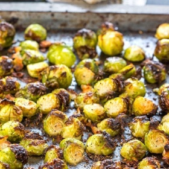

# [Brussels Sprouts](https://www.errenskitchen.com/the-best-brussels-sprouts-of-your-life/)
> **tags**: #Vegetarian #0star

## Description

## Ingredients

- 1 pound Brussels Sprouts Cleaned and trimmed
- 3 cloves garlic peeled & sliced *See the notes section before starting
- 1/4 cup Parmesan Cheese Freshly grated
- salt and freshly ground black pepper To taste
- 3 tablespoons good quality olive oil or for Keto, butter flavor coconut oil

## Directions
Place the prepared Brussel sprouts on a large roasting pan or a large baking sheet and arrange in a single layer.

Add olive oil.

Add thinly sliced garlic to the pan evenly.

Preheat the oven to 400°F/200°C.

If needed, clean and trim the Brussels sprouts and cut them in halves and place them in an oven safe dish. Make sure to dry them very well before cooking.

Add the garlic, Parmesan cheese, salt, and pepper, followed by the olive oil. Toss to coat.

Roast in the oven uncovered for 20-25 minutes until crisp, brown and caramelized on the outside and tender on the inside. Serve with more grated cheese.

## Notes

## Data
**prep** 5 minutes | **cook** 20 minutes | **total**  | **serves** Serves: 4