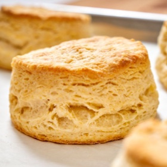

# [Buttermilk Biscuits](https://www.seriouseats.com/the-food-lab-buttermilk-biscuits-recipe)
> **tags**: #Quick Bread #5star

## Description

## Ingredients

- 1/2 cup (120ml) buttermilk
- 1/2 cup sour cream (4 ounces; 113g)
- 10 ounces all-purpose flour (2 1/4 cups; 284g), plus additional for dusting
- 1 tablespoon (12g) baking powder
- 1/4 teaspoon baking soda
- 1 1/2 teaspoons Diamond Crystal kosher salt; for table salt, use half as much by volume
- 8 tablespoons cold unsalted butter (4 ounces; 113g), cut into 1/4-inch pats, plus 2 tablespoons (1 ounce; 28g) melted unsalted butter for brushing

## Directions
Adjust an oven rack to the middle position and preheat the oven to 425°F (220°C). In a small bowl, whisk together the buttermilk and sour cream.

In the bowl of a food processor, combine flour, baking powder, baking soda, and salt and process until blended, about 2 seconds. Scatter cold butter evenly over flour and pulse until the mixture resembles coarse meal and the largest butter pieces are about 1/4-inch at their widest, about 8 times. Transfer to a large bowl.

Add the buttermilk mixture to the flour mixture and, using a rubber spatula, fold until just combined. Transfer the dough to a floured work surface and knead until it just comes together, adding extra flour as necessary.

With a rolling pin, roll the dough into a 12- by 8-inch rectangle. Using a bench scraper, fold the right third of the dough over the center, then fold the left third over so you end up with a 12- by 4-inch rectangle. Fold the top third down over the center, then fold the bottom third up so the whole thing is reduced to a 4-inch square. Press the square down and roll it out again into a 12- by 8-inch rectangle. Repeat the folding process once more. (See note for cheddar cheese and scallion variation.)

Roll the dough again into a 10- by 6-inch rectangle (about 1-inch thick). Using a floured biscuit cutter, cut eight 2 1/2–inch rounds out of the dough. Transfer the rounds to a parchment-lined baking sheet, spacing them about 1 inch apart. Form the dough scraps into a ball and knead gently 2 or 3 times, until smooth. Roll the dough out until it’s large enough to cut out 4 more 2 1/2-inch rounds, and transfer to the baking sheet.

Brush the tops of the biscuits with the melted butter and bake until golden brown and well risen, about 14 minutes, rotating the pan halfway through. Allow to cool for 5 minutes and serve.

## Notes

## Data
**prep** 10 mins | **cook** 20 mins | **total**  | **serves** 8 biscuits