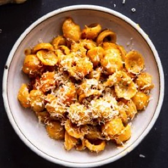

# [Butternut Squash Risotto](https://www.seriouseats.com/pressure-cooker-butternut-squash-risotto-sage-brown-butter-quick-easy-recipe)
> **tags**: #Italian #0star

## Description

## Ingredients

- 3 1/2 pounds (1.6kg) butternut squash, peeled and seeded
- 6 tablespoons (90ml) extra-virgin olive oil, divided
- 3 medium cloves garlic, crushed
- 1/2 Golden Delicious apple, peeled and cored
- Pinch red pepper flakes
- 2 sprigs sage plus 8 sage leaves, divided
- Kosher salt
- 2 tablespoons (30ml) maple syrup
- 1 teaspoon (5ml) white or yellow miso
- 3 3/4 cups (900ml) homemade or store-bought low-sodium vegetable broth, divided
- 1 medium yellow onion, minced
- 2 cups (400g) risotto rice, such as arborio
- 1/2 cup (120ml) dry white wine
- 4 tablespoons (55g) unsalted butter
- Parmigiano-Reggiano cheese, for grating

## Directions
Preheat oven to 400°F (200°C). Cut about half the squash into 1-inch chunks, to yield 4 cups. Cut remaining squash into 1/4-inch dice. In a large mixing bowl, toss large squash chunks with 2 tablespoons (30ml) olive oil, garlic, apple, red pepper flakes, sage sprigs, and a large pinch of salt until evenly coated, then spread in an even layer on a rimmed baking sheet. In a separate bowl, toss small diced squash with 2 tablespoons (30ml) olive oil, maple syrup, and a pinch of salt, then spread in an even layer on a second rimmed baking sheet.

Bake both trays of squash, stirring once or twice during baking, until large chunks are very tender, about 45 minutes, and small diced squash is browned in spots, about 30 minutes. Discard sage sprigs from large squash chunks.

Transfer large squash chunks, apple, and garlic cloves to a food processor, blender, or the container of a stick blender. Add miso and 1/4 cup (60ml) broth and blend until a smooth purée forms. Season with salt.

Heat remaining 2 tablespoons (30ml) olive oil in a pressure cooker over medium-high heat until shimmering. Add onion and cook, stirring, until translucent but not browned, about 4 minutes.

Add rice and cook, stirring, until rice is evenly coated in oil and toasted but not browned, 3 to 4 minutes. (Rice grains should start to look like tiny ice cubes: translucent around the edges and cloudy in the center.)

Add wine and cook, stirring, until raw alcohol smell has cooked off and wine has almost fully evaporated, about 2 minutes.

Stir in remaining 3 1/2 cups (840ml) broth; scrape any grains of rice or pieces of onion from side of pressure cooker so that they are fully submerged. Close pressure cooker and bring up to low pressure (10 psi on most units). Cook at low pressure for 5 minutes, then depressurize cooker either by running it under cold water if it is not electric, or using the steam-release valve if it is electric.

Meanwhile, in a small saucepan, melt butter over medium-high heat until foaming subsides, 2 to 3 minutes. Add remaining 8 sage leaves and fry, gently swirling, until milk solids in butter turn a hazelnut-brown color, 1 to 2 minutes longer. Remove from heat. Using a slotted spoon, transfer sage leaves to a paper towel–lined plate.

Open pressure cooker and stir to combine rice and cooking liquid; it should begin to develop a creamy consistency. Stir in squash purée.

Stir in brown butter. If risotto is too soupy, cook for a few minutes longer, stirring, until it begins to thicken more; it should look like a smooth, creamy sauce.

Stir in a generous grating of Parmesan cheese, followed by the maple-roasted diced squash. Season with salt. Spoon risotto onto plates, top with fried sage leaves and more grated cheese, and serve.

## Notes
To learn how to prepare, peel, and cut butternut squash, check out our knife skills guide.

## Data
**prep** 60 mins | **cook** 60 mins | **total**  | **serves** 4 servings