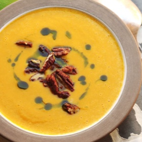

# [Butternut Squash Soup](https://www.seriouseats.com/easy-stovetop-butternut-squash-soup-recipe)
> **tags**: #Soup #4star

## Description

## Ingredients

- 4 tablespoons (50g) unsalted butter
- 1 onion, diced (about 6 ounces; 170g)
- 2 stalks celery, diced (about 4 ounces; 115g)
- 1 carrot, diced (about 4 ounces; 115g)
- 3 sprigs thyme (optional)
- salt
- black pepper
- 1 1/2 quarts homemade chicken or vegetable stock, or store-bought low-sodium chicken stock (about 1.5 liters)
- One (2 1/4 pound; 1kg) butternut squash, peeled, seeded, and cut into rough chunks
- 2 bay leaves
- 1/2 cup heavy cream (120ml) (optional)
- Small squeeze fresh lemon juice
- 1 to 2 tablespoons brown or white sugar (15 to 30g) (optional, see notes)

## Directions
Heat butter in a large saucepan or Dutch oven over medium-high heat until melted. Continue cooking, swirling pan constantly, until butter solids are lightly browned and the butter smells nutty, about 1 minute longer. Immediately add onion, celery, carrot, and whole thyme sprigs (if using), reduce heat to medium, season with salt and pepper, and cook, stirring occasionally, until vegetables are softened but not browned, about 5 minutes.

Add stock, squash, and bay leaves. Increase heat to high and bring to a boil. Reduce to a bare simmer and cook until squash is completely tender, about 20 minutes.

Using tongs, discard bay leaves and thyme stems. Add heavy cream. Using an immersion blender or working in batches in a countertop blender, blend soup until completely smooth. Season to taste with salt, pepper, and lemon juice. Add sugar if desired (some squashes are naturally sweeter than others). Serve.

## Notes
You can also use maple syrup or honey in place of the sugar if desired.

Glazed pecans make a great garnish when serving (or try this recipe, but swap pecans for the almonds). You can also sprinkle with minced fresh herbs like chives, parsley, or sage. Try drizzling with browned butter or olive oil if desired.

## Data
**prep**  | **cook** 35 mins | **total**  | **serves** 6 to 8 servings