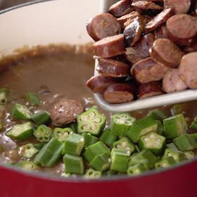

# [Cajun Gumbo with Chicken and Andouille Sausage](https://www.seriouseats.com/cajun-gumbo-with-chicken-and-andouille-recipe)
> **tags**: # #0star

## Description

## Ingredients

- 1 cup plus 1 tablespoon (250ml) canola or vegetable oil, divided
- 6 boneless, skinless chicken thighs (about 2 1/4 pounds; 1kg total)
- Kosher salt
- 1 1/2 pounds Cajun-style andouille sausage (680g; about 8 links), sliced crosswise 1/2 inch thick
- 1 cup all-purpose flour(4 1/2 ounces; 130g)
- 2 large yellow onions (about 12 ounces; 340g each), cut into 1/4-inch dice
- 2 green bell peppers (about 7 ounces; 200g each), cut into 1/4-inch dice
- 4 large celery ribs (9 ounces; 260g total), cut into 1/4-inch dice
- 8 medium cloves garlic, minced
- 1/4 teaspoon cayenne pepper
- Freshly ground black pepper
- 1 1/2 quarts (1.4L) homemade brown or white chicken stock or store-bought low-sodium chicken stock
- 2 dried bay leaves
- 2 large sprigs fresh thyme
- 1 pound (450g) fresh okra, caps trimmed, pods cut crosswise 1/2 inch thick (optional; see note)
- 1/2 teaspoon filé powder, plus more as needed for serving (optional; see note)
- Warm rice, thinly sliced scallions, and hot sauce, for serving

## Directions
In a large Dutch oven, heat 1 tablespoon (15ml) oil over medium-high heat until shimmering. Season chicken all over with salt. Working in batches, sear chicken until browned on both sides, about 5 minutes per side. Transfer chicken to a platter, then set aside until cool enough to handle. Once chicken has cooled, shred into bite-size pieces.

Add sliced andouille to pot and cook, stirring, until lightly browned, about 6 minutes. Using a slotted spoon, transfer to a platter and set aside.

Add remaining 1 cup (235ml) oil to Dutch oven along with flour, stirring to form a paste. Lower heat to medium-low and cook, stirring and scraping frequently, until roux is a chestnut or chocolate-brown color but not scorched, about 1 hour. Alternatively, you can combine the flour and 1 cup oil in a separate ovenproof vessel and cook, uncovered, in a 350°F (180°C) oven, stirring occasionally, until roux is chestnut or chocolate-brown, about 4 hours, though how long this will take can vary dramatically depending on your oven. You can add the finished oven roux to the pot on the stovetop after removing the sausage, then immediately proceed to the next step of sautéing the aromatics.

Add onion, bell pepper, and celery and season lightly with salt. Cook over medium-high heat, stirring and scraping, until softened, about 10 minutes; lower heat to medium if any of the ingredients threaten to scorch.

Stir in garlic, cayenne, and a generous amount of black pepper and cook, stirring, for 2 minutes longer.

Add stock, bay leaves, and thyme. Season lightly with salt. Bring to a gentle simmer, then allow to cook uncovered, stirring occasionally, for 1 hour. Add okra, if using, along with sausage and shredded chicken, and gently simmer, uncovered, for 1 hour longer. Skim any fat from the surface as it accumulates.

Remove from heat and add filé powder, if using, stirring well to break up any small lumps. Season gumbo with salt. Discard thyme sprigs and bay leaves.

Serve gumbo with warm rice, sprinkling sliced scallions on top of each bowl. Pass hot sauce at the table, as well as filé powder, if desired, to lightly shake on top of each serving of gumbo and rice.

## Notes

## Data
**prep** 0 mins | **cook** 4 hrs | **total**  | **serves** 10 servings