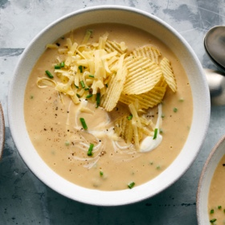

# [Cauliflower, Potato and White Bean Soup](https://cooking.nytimes.com/recipes/1022831-slow-cooker-cauliflower-potato-and-white-bean-soup)
> **tags**: #Soup #5star

## Description

## Ingredients

- 1 pound Yukon gold potatoes, scrubbed, peeled and cut into 1- to 2-inch chunks
- 1 pound cauliflower, chopped into large bite-sized florets and stems
- 2 (15-ounce) cans cannellini beans, drained
- 1/2 onion, minced
- 3 garlic cloves, smashed and minced
- 3 1/2 cups vegetable stock
- 3 tablespoons unsalted butter
- 2 tablespoons dry white wine
- 1 sprig fresh thyme or 1/2 teaspoon dried thyme
- 1/2 teaspoon garlic powder
- salt
- black pepper
- 1 teaspoon lemon juice (about 1/4 lemon)
- 8 ounces sour cream (1 cup), at room temperature
- 1/2 cup chopped chives (about 1 small bunch)
- Potato chips, preferably sour cream and onion, for topping
- Shredded Cheddar, for serving

## Directions
In a 6- to 8-quart slow cooker, combine the potatoes, cauliflower, beans, onion, garlic, vegetable stock, butter, wine, thyme, garlic powder and 1½ teaspoons kosher salt. Cover and cook until the vegetables are very tender, about 8 hours on low. 

Remove and discard the thyme sprig, and turn off the slow cooker. Add the lemon juice. To make a completely smooth and creamy soup, purée the ingredients using an immersion blender. (Or, purée the soup in a blender in two batches, transferring the puréed soup to a different pot.) To make a textured, chunky soup, smash the ingredients using a potato masher in the slow cooker. Stir in the sour cream and chives. Taste and add additional salt if necessary. Serve in bowls topped with black pepper, crushed potato chips and shredded Cheddar. For leftovers, gently reheat the soup on the stovetop or in the microwave until it just barely bubbles around the edges; don’t let it boil or the sour cream will break.

## Notes

## Data
**prep**  | **cook** 8 hr 25 min | **total** 8 hr 25 min | **serves** 6 servings