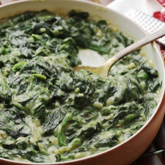

# [Cauliflower-Creamed Spinach](https://www.seriouseats.com/vegan-cauliflower-creamed-spinach-recipe)
> **tags**: #Easy #Sides #Steph #Vegan #Vegetarian #5star

## Description

## Ingredients

- 6 ounces cauliflower florets (170g; about 1/3 of a small head)
- 6 ounces almond, soy, rice, or cashew milk (2/3 cup; 170ml)
- 2 tablespoons (30ml) coconut oil
- 1 medium onion, finely chopped (about 8 ounces; 225g)
- 3 medium cloves garlic, minced
- 1/2 teaspoon freshly grated nutmeg
- 1 pound (450g) mature curly or flat-leaf spinach, washed well and roughly chopped
- Kosher salt and freshly ground black pepper

## Directions
Combine cauliflower and milk of choice in a small saucepan. Bring to a simmer over medium heat, cover, reduce heat to lowest setting, and let cook until cauliflower is completely tender, about 10 minutes. Using an immersion blender or countertop blender, blend into a smooth purée. Set aside.

Heat coconut oil over medium heat in a large saucepan until melted. Add onion and cook, stirring frequently, until softened but not browned, about 4 minutes. Add garlic and cook, stirring constantly, until fragrant, about 30 seconds. Add nutmeg and stir to combine. Add spinach one handful at a time, stirring and folding until each handful of spinach is wilted, before adding the next.

Add cauliflower purée to spinach mixture and stir to combine. Bring to a bare simmer and cook, stirring occasionally, until spinach is completely tender and mixture is creamy. Season to taste with salt and pepper and serve.

## Notes

## Data
**prep**  | **cook** 45 mins | **total**  | **serves** 4 to 6 servings