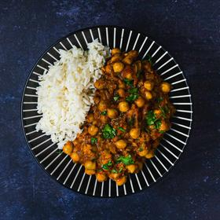

# [Channa Masala](https://www.seriouseats.com/channa-masala-recipe)
> **tags**: #Indian #5star

## Description

## Ingredients

- 4 medium cloves garlic, roughly chopped
- 1 (1-inch) knob ginger, peeled, roughly chopped
- 1 to 6 green Thai chiles (to taste), roughly chopped
- 2 tablespoons (30ml) juice from 1 lemon, divided
- Kosher salt
- 2 tablespoons (30ml) vegetable oil or ghee
- 2 teaspoons (8g) black mustard seeds
- 1 teaspoon (4g) whole cumin seeds
- 1 large onion, finely diced (about 1 1/2 cups; 300g)
- 1/4 teaspoon (1g) baking soda
- 2 teaspoons (8g) ground coriander
- 1/2 teaspoon (2g) freshly ground black pepper
- 1/2 teaspoon (2g) ground turmeric
- 1 1/2 teaspoons (6g) store-bought or homemade garam masala, divided
- 1 (14-ounce) can whole peeled tomatoes
- 2 (14-ounce) cans chickpeas, drained and rinsed
- 1 cup cilantro leaves, roughly chopped (1 ounce; 25g)

## Directions
Combine garlic, ginger, chiles, 1 tablespoon lemon juice, and 1/2 teaspoon kosher salt in a mortar and pestle or in the small work bowl of a food processor and pound or process until a fine paste is produced. Set aside.

Heat oil or ghee in a large saucepan or Dutch oven over medium-high heat until shimmering. All at once, add mustard seeds and cumin. They will sputter and spit for a few seconds. As soon as they are aromatic (about 15 seconds), add onion all at once, along with baking soda. Cook, stirring frequently, until onions start to leave a brown coating on bottom of pan, 3 to 4 minutes. Add 1 tablespoon water, scrape up browned bits from pan, and continue cooking. Repeat this process until onions are a deep brown, about 10 minutes total.

Immediately add garlic/ginger/chile paste all at once and stir to combine. Add coriander, black pepper, turmeric, and 1 teaspoon garam masala. Stir until fragrant, about 30 seconds. Add tomatoes and crush them using a whisk or potato masher. Add drained, rinsed chickpeas and cilantro, reserving a little cilantro for garnish. Add 1/2 cup water.

Bring to a simmer, cover with lid slightly cracked, and reduce heat to maintain a gentle bubbling. Cook, stirring occasionally, until liquid has reduced into a thick stew and spices have melded, about 30 minutes.

Stir in remaining garam masala and lemon juice. Season to taste with salt. Serve with rice and/or naan, sprinkling additional cilantro on top.

## Notes

## Data
**prep** 5 mins | **cook** 50 mins | **total**  | **serves** 4 to 6 servings