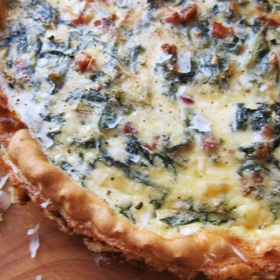

# [Chard, Pancetta, and Pecorino Quiche](https://www.seriouseats.com/chard-pancetta-pecorino-quiche-recipe)
> **tags**: #Dinner #5star

## Description

## Ingredients

- 1 recipe easy pie dough, made with no sugar
- 2 ounces pancetta, cut into 1/4-inch cubes (about 1 cup)
- 14 ounces Swiss chard, tough ends removed, leaves chopped (about 3 quarts loosely packed leaves)
- Kosher salt and freshly ground black pepper
- A pinch of ground nutmeg
- 6 large eggs
- 1 cup milk
- 1/2 cup crème fraîche
- 1 cup coarsely grated Pecorino Romano

## Directions
Preheat the oven to 400°F. Line a pie plate with the piecrust. Dock, and bake until golden, 12 to 15 minutes. Remove from oven and allow to cool.

Meanwhile, add the pancetta to a large straight-sided sauté pan and cook over medium-high heat, stirring occasionally, until fat is rendered and pancetta starts to crisp, about 5 minutes. Add the chard and season with salt, pepper, and a pinch of ground nutmeg. Cook, stirring often, until the chard is wilted and the pan is dry, 5 to 8 minutes longer.

Scatter the chard and pancetta over the crust. In a large bowl, whisk together the eggs, milk, crème fraîche, and Pecorino. Season to taste with salt and pepper. Pour mixture over chard and and return to the oven until quiche is barely set (the center should still jiggle) and a cake tester or toothpick inserted in the center comes out clean, 25 to 30 minutes. Allow to cool slightly. Serve warm or at room temperature.

## Notes

## Data
**prep**  | **cook** 45 mins | **total**  | **serves** 4 to 6 servings