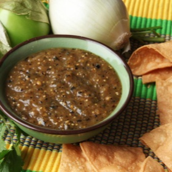

# [Charred Salsa Verde](https://www.seriouseats.com/charred-salsa-verde-tomatillo-salsa)
> **tags**: #Mexican #0star

## Description

## Ingredients

- 1 1/2 pounds tomatillos, husks removed, split in half (680g; about 10 medium)
- 1 medium white onion, peeled and split in half (about 6 ounces; 170g)
- 2 to 4 Serrano or jalapeño chiles (adjust according to spice tolerance, remove seeds and ribs for milder spice), split in half
- 10 to 15 sprigs cilantro, tough lower stems discarded
- 1 tablespoon vegetable oil
- Kosher salt

## Directions
Adjust oven rack to 4 inches below broiler and preheat broiler to high. Place tomatillos, onion, and chiles on a foil-lined rimmed baking sheet. Broil until darkly charred and blackened on top and tomatillos are completely tender, 6 to 12 minutes.

Transfer vegetables and their juice to a blender, food processor, or the cup of an immersion blender. Add half of cilantro. Blend in pulses until a rough purée is formed.

Heat oil in a medium saucepan over high heat until shimmering. Pour salsa into the hot oil all at once (it will steam and sputter). Immediately start stirring and continue to cook, stirring, until salsa is darkened and thick enough to coat the back of the spoon, about 3 minutes. Remove from heat.

Finely chop remaining cilantro and stir into salsa. Season to taste with salt. Let cool, then serve. Salsa can be stored in the refrigerator for up to 5 days.

## Notes

## Data
**prep** 15 mins | **cook** 15 mins | **total**  | **serves** 24 servings