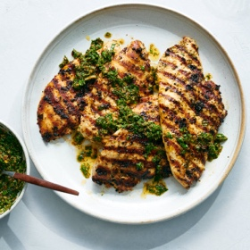

# [Chicken Chimichurri](https://cooking.nytimes.com/recipes/1020543-mayo-marinated-chicken-with-chimichurri)
> **tags**: #Chicken #Mains #5star

## Description

## Ingredients

- 4 chicken breast cutlets (4 to 5 ounces each), pounded about 1/4-inch thick
- Kosher salt and ground black pepper
- 1/3 cup store-bought or homemade mayonnaise
- 1 cup chimichurri (see recipe)

## Directions
Season chicken cutlets on both sides with salt and pepper and set aside.

Whisk together mayonnaise and 1/4 cup chimichurri in a large bowl. Reserve remaining chimichurri. Add chicken cutlets to the mixture and turn to coat. Cook immediately, or for better flavor, transfer to a sealed container and refrigerate for 4 to 24 hours.

To cook on the grill: Heat a gas or charcoal grill over high heat for 10 minutes. Cook chicken cutlets directly over high heat, turning and flipping occasionally, until just cooked through and lightly charred all over, about 4 to 5 minutes. Transfer chicken to a serving platter. Spoon some of the remaining chimichurri over the chicken and serve the rest in a small bowl on the side.

To cook in a skillet: Heat a large (12-inch) cast-iron or nonstick skillet over medium-high heat until a drop of water immediately balls up and dances across the surface. Add chicken cutlets in a single layer and cook, swirling them and flipping them occasionally until browned all over and just cooked through, about 4 minutes. Transfer chicken to a serving platter. Spoon some of the remaining chimichurri over the chicken and serve the rest in a small bowl on the side.

## Notes

## Data
**prep**  | **cook**  | **total** 10 min | **serves** 2 to 4 servings