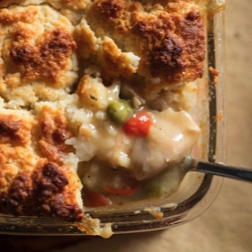

# [Chicken Pot Pie with Buttermilk Biscuit Topping](https://www.seriouseats.com/chicken-pot-pie-biscuit-topping-recipe)
> **tags**: #Chicken #To Try #0star

## Description

## Ingredients

### For the Chicken
- 2 quarts (1.9L) homemade or store-bought low-sodium chicken stock
- 4 1/2 pounds (2kg) assorted bone-in, skin-on chicken legs, thighs, and breasts
- 1 large onion, diced (about 8 ounces; 2 cups; 225g)
- 2 large carrots, diced (about 8 ounces; 1 1/3 cups; 225g)
- 2 large celery ribs, diced (about 5 ounces; 3/4 cup; 140g)
- 2 medium garlic cloves, crushed
- 2 sprigs thyme
- 1 sprig flat-leaf parsley
- 1 sprig rosemary
- 1 bay leaf

### For the Filling
- 1/2 ounce gelatin (4 1/2 teaspoons; 15g)
- 1/4 cup (55ml) reserved chicken stock, cooled
- 4 ounces unsalted butter (8 tablespoons; 115g)
- 4 ounces all-purpose flour (1 cup minus 1 tablespoon; 115g)
- 1 medium onion, diced (about 7 ounces; 1 2/3 cups; 200g)
- 1 large carrot, diced (4 ounces; 3/4 cup; 115g)
- 1 large celery rib, diced (4 ounces; 3/4 cup; 115g)
- 1/2 cup (115ml) dry white wine
- 1 quart (900ml) reserved chicken stock
- 5 ounces frozen peas (1 heaping cup; 140g)
- 3 ounces drained and diced pimento peppers (1/2 cup; 85g), or more to taste (see note)
- 1 3/4 teaspoons (7g) Diamond Crystal kosher salt; for table salt, use about half as much by volume or the same weight
- 1/4 ounce fresh thyme leaves (about 1 teaspoon; 7g)
- 1 teaspoon (5g) freshly ground black pepper, or more to taste
- 1 1/2 teaspoons (7ml) Worcestershire sauce
- 28 ounces poached chicken, from above (4 cups, shredded; 795g), or more to taste

### For the Biscuit Topping
- 9 ounces all-purpose flour, such as Gold Medal (about 2 cups, spooned; 250g)
- 1 ounce sugar (about 2 tablespoons; 30g)
- 1 tablespoon baking powder
- 1 1/2 teaspoons (6g) Diamond Crystal kosher salt; for table salt, use about half as much by volume or the same weight
- 8 ounces cold unsalted butter (16 tablespoons; 230g), cut into 1/2-inch cubes
- 8 ounces cultured lowfat buttermilk or kefir (about 1 cup; 225g), straight from the fridge

## Directions
For the Chicken: Combine chicken stock, chicken parts, onion, carrots, celery, garlic, thyme, parsley, rosemary, and bay leaf in a 5-quart stainless steel pot or saucier. Cover and place over medium-high heat until stock registers about 150°F (66°C) on a digital thermometer.

Adjust heat to maintain that temperature, plus or minus 10°F (5-6°C), and cook until thickest part of chicken registers 135°F (57°C), about 1 hour. Remove chicken with tongs, set aside on a rimmed platter, and cover loosely. Strain stock through a mesh sieve into a large bowl, discard solids, and set stock aside to cool.

For the Filling: Combine gelatin and 1/4 cup (55ml) cooled stock in a small bowl and whisk until no lumps remain; set aside. In a 5-quart saucier, melt butter over medium-low heat, then whisk in flour. Stir with a heat-resistant spatula until roux is fragrant and a nutty blond color, about 5 minutes (it's okay to adjust the heat if this seems to be happening too slowly). Stir in diced onion, carrots, and celery and continue cooking and stirring until vegetables are slightly softened, about 7 minutes more.

Add white wine and 1 quart reserved stock, stirring constantly until smooth; remaining stock from poaching can be reserved for another use. Increase heat to medium-high and bring to a boil, stirring constantly. Once it begins to bubble, remove from heat. Stir in frozen peas, diced pimentos, and prepared gelatin, followed by salt, thyme, pepper, and Worcestershire sauce. Stir until gelatin has fully melted into sauce and adjust seasonings to taste.

Shred or dice reserved chicken, discarding skin and bones, then stir into filling. If it better suits your schedule, the filling can be covered and refrigerated up to 3 days, or frozen in an airtight container for 3 months. Otherwise, divide filling between 6 individual oven-safe dishes, or add to a 2-quart glass or ceramic baking dish (approximately 7 by 11 inches). Place on a foil- or parchment-lined baking sheet and set aside.

For Biscuit Topping: Adjust oven rack to middle position and preheat oven to 400°F (200°C). In a medium bowl, whisk together flour, sugar, baking powder, and salt. Add butter and toss to break up the pieces, then smash each one flat between your fingertips. Continue smashing and rubbing until butter is broken up into small pieces, like cereal flakes. Stir in buttermilk with a flexible spatula, then drop the thick dough in 1-tablespoon portions over prepared filling.

Bake until biscuits are golden brown and filling is bubbling-hot, about 45 minutes to 1 hour, depending on whether filling has been chilled. Cool at least 30 minutes before serving to allow the filling to thicken and reach a safe temperature to enjoy. Covered in foil, leftovers can be refrigerated up to 3 days and reheated to serve.

Filling can be covered and refrigerated up to 3 days, or frozen in an airtight container for 3 months. Covered in foil, leftovers can be refrigerated up to 3 days and reheated to serve.

## Notes
If you can't find them alongside jars of pickles and olives at the store, look for pimento peppers at the supermarket salad bar.

## Data
**prep** 20 mins | **cook** 3 hrs | **total**  | **serves** 6 servings