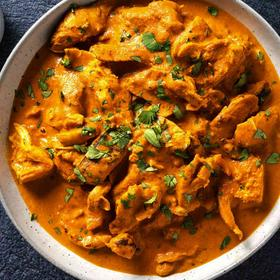

# [Chicken Tikka Masala](https://www.seriouseats.com/chicken-tikka-masala-for-the-grill-recipe)
> **tags**: #Asian #Indian #0star

## Description

## Ingredients

- 5 pounds bone-in chicken pieces (breasts, legs, or a mix), skin removed
- 3 tablespoons toasted ground cumin
- 3 tablespoons toasted paprika
- 2 tablespoons toasted ground coriander seed
- 2 teaspoons ground turmeric
- 1 teaspoon cayenne pepper
- 12 cloves garlic, grated on the medium holes of a box grater, divided
- 3 tablespoons fresh ginger, grated on the medium holes of a box grater, divided
- 2 cups yogurt
- 3/4 cup fresh juice from 4 to 6 lemons, divided
- Diamond Crystal kosher salt; for table salt, use about half as much by volume
- 4 tablespoons butter or ghee
- 1 large onion, thinly sliced
- 1 (28-ounce) can whole peeled tomatoes, roughly mashed
- 1/2 cup roughly chopped cilantro leaves and tender stems
- 1 cup heavy cream

## Directions
Place chicken pieces on a cutting board flesh-side up. Score deeply at 1-inch intervals with a sharp knife. Place in a large rimmed baking dish.

Combine cumin, paprika, coriander, turmeric, and cayenne in a small bowl and mix well. Set aside 3 tablespoons of spice mixture. Combine remaining 6 tablespoons spice mixture, 8 cloves garlic, 2 tablespoons ginger, yogurt, 1/2 cup lemon juice, and 1/4 cup salt in a large bowl and whisk to combine. Pour marinade all over chicken pieces, using hands to coat every surface. Cover loosely and refrigerate. Refrigerate and allow to marinate for at least 4 hours and up to 8, turning occasionally.

Meanwhile, heat butter or ghee in a large Dutch oven over medium-high heat until melted and foaming subsides. Add onions, remaining 4 tablespoons grated garlic, and remaining 2 tablespoons ginger. Cook, stirring frequently, until dark and beginning to char in spots, about 10 minutes. Add reserved spice mixture and cook, stirring frequently, until fragrant, about 30 seconds. Add tomatoes and half of cilantro, scraping up any browned bits from bottom of pan with a spoon. Simmer for 15 minutes, then puree using a hand blender or by transferring to a tabletop blender in batches.

Stir in cream and remaining quarter cup lemon juice. Season to taste with salt, then set aside until chicken is cooked.

TO COOK ON THE GRILL: Light one chimney full of charcoal. When all the charcoal is lit and covered with gray ash, pour out and spread the coals evenly over half of coal grate. Set cooking grate in place, cover grill and allow to preheat for 5 minutes. Clean and oil the grilling grate. Wipe excess marinade off chicken and place over hot side of grill, flesh-side-down. Grill without moving until well charred, 5 to 7 minutes. Flip chicken and cook until second side is charred, another 4 to 5 minutes. (Chicken will not be completely cooked through—this is ok). Transfer to cutting board and let rest 10 minutes.

TO COOK UNDER THE BROILER: Line a broiler pan with heavy duty aluminum foil and preheat the broiler to high with the rack set 6 inches below broiler element. Wipe excess marinade off chicken and place on foil-lined pan, flesh side up. Broil until charred and blackened on surface, about 8 minutes (chicken will not be completely cooked through—this is ok). Transfer to cutting board and let rest 10 minutes.

Remove chicken from bone using a sharp knife and cut into rough bite-sized chunks. Transfer chicken chunks to pot of sauce. Bring to a simmer over medium heat and cook, stirring frequently, until chicken is just cooked through, about 10 minutes. Sprinkle with remaining cilantro, then serve immediately with rice or Grilled Naan.

## Notes

## Data
**prep** 15 mins | **cook** 40 mins | **total**  | **serves** 4 to 6 servings