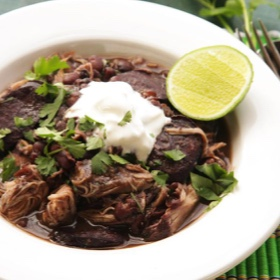

# [Chicken and Black Bean Stew](https://www.seriouseats.com/quick-and-easy-pressure-cooker-chicken-black-bean-stew-recipe)
> **tags**: #Soup #5star

## Description

## Ingredients

- 1 tablespoon (15ml) vegetable or other neutral oil
- 8 ounces smoked sausage (227g), such as andouille or kielbasa, sliced into 1/4-inch disks (1 2/3 cups)
- 1 medium onion (8 ounces; 227g), diced (about 1 cup)
- 2 teaspoons ground cumin
- Two 4-ounce cans diced green chiles (preferably Hatch)
- 8 ounces (227g) dried black beans (1 heaping cup)
- 12 sprigs cilantro, leaves roughly chopped (1/2 cup), stems tied together with a piece of kitchen twine, divided
- 1 quart (950ml) homemade or store-bought low-sodium chicken stock
- 1 teaspoon Diamond Crystal kosher salt, plus more to taste; for table salt, use half as much by volume
- 1/2 teaspoon freshly ground black pepper, plus more to taste
- 4 chicken legs, divided into thighs and drumsticks (about 2 pounds; 900g)
- Sour cream, for serving
- Lime wedges, for serving

## Directions
In a pressure cooker, heat oil over medium-high heat until shimmering. Add sausage and cook until starting to crisp around edges, about 2 minutes. Add onion and cook, stirring, until softened, about 3 minutes longer. Add cumin and cook until fragrant, about 30 seconds. Add chiles, dried black beans, cilantro stems, and stock. Season with salt and pepper and stir to combine. Seal pressure cooker and bring to high pressure. Cook for 30 minutes. Cool pressure cooker under a cold running tap (if using an electric cooker, use the quick release valve), and open.

Add chicken pieces to pressure cooker. Seal pressure cooker and bring to high pressure. Cook for 10 minutes. Cool pressure cooker under a cold running tap (if using an electric cooker, use the quick release valve), and open. Using tongs, transfer chicken pieces to a medium bowl. Discard cilantro stems. Return beans in pressure cooker to high heat and continue cooking, stirring, until reduced to a thick, stew-like consistency, about 10 minutes.

Serious Eats / J. Kenji López-Alt

Meanwhile, shred chicken and discard skin and bones. Stir chicken into beans, season to taste with salt and pepper, and stir in half of chopped cilantro leaves. Serve with sour cream, lime wedges, and remaining cilantro at the table.

## Notes

## Data
**prep** 10 mins | **cook** 90 mins | **total**  | **serves** 4 to 6 servings