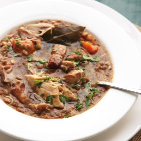

# [Chicken, Lentil, and Bacon Stew with Carrots](https://www.seriouseats.com/quick-and-easy-pressure-cooker-chicken-lentil-bacon-stew-recipe)
> **tags**: #Easy #Soup #5star

## Description

## Ingredients

- 2 tablespoons olive oil, plus more for serving
- 8-ounce slab bacon or pancetta, cut into 1/2-inch lardons
- 1 onion, diced (about 1 cup)
- 2 medium carrots, peeled and roughly chopped
- 8 ounces lentils, such as Le Puy
- 12 sprigs parsley, leaves roughly chopped, stems tied together with a piece of kitchen twine
- 2 bay leaves
- 2 1/2 pounds bone-in, skin-on chicken pieces (a mix of thighs and drumsticks for best texture, though breasts will work as well)
- 1 quart homemade or store-bought low-sodium chicken stock
- salt
- black pepper
- 2 teaspoons sherry vinegar, plus more to taste

## Directions
Heat oil in a pressure cooker over medium-high heat until shimmering. Add bacon and cook until starting to crisp around edges, about 1 minute. Add onions and cook, stirring, until softened but not browned, about 2 minutes longer. Add carrots, lentils, parsley stems, bay leaves, chicken legs, and chicken stock. Season gently with salt and pepper and stir to combine.

Seal pressure cooker and bring to high pressure. Cook for 20 minutes. Cool pressure cooker under a cold running tap (if using an electric cooker, use the quick release valve), and open. Using tongs, transfer chicken pieces to a bowl. Discard parsley stems. Return lentils to high heat and continue cooking, stirring, until reduced to a thick, stew-like consistency, about 5 minutes. Meanwhile, shred chicken, discarding bones and skin.

Stir chicken and vinegar into beans. Season to taste with salt and pepper, stir in half of chopped parsley, and serve, passing remaining parsley, sherry vinegar, and olive oil at the table.

## Notes

## Data
**prep**  | **cook** 45 mins | **total**  | **serves** 4 servings