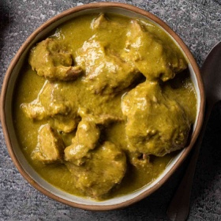

# [Chile Verde Pork](https://www.seriouseats.com/easy-pressure-cooker-pork-chile-verde-recipe)
> **tags**: #Mexican #4star

## Description

## Ingredients

- 4 pounds (1.9kg) boneless pork shoulder, cut into 2-inch chunks
- 3/4 pound tomatillos (about 4 large tomatillos; 350g), quartered, husks discarded
- 2/3 pound poblano peppers (about 2 peppers; 300g), roughly chopped, seeds and stems discarded (see note)
- 6 ounces Anaheim or Cubanelle peppers (about 2 peppers; 170g), roughly chopped, seeds and stems discarded (see note)
- 2 serrano or jalapeño chiles, roughly chopped, stems discarded (see note)
- 8 ounces white onion (about 1 medium; 225g), roughly chopped
- 6 medium cloves garlic, peeled
- 1 tablespoon (15g) whole cumin seeds, toasted and ground (see note)
- salt
- 1/2 cup loosely packed fresh cilantro leaves and fine stems (about 1/2 ounce; 15g), plus more for garnish
- 1 tablespoon (15ml) Asian fish sauce, such as Red Boat
- Fresh corn tortillas and lime wedges, for serving

## Directions
In a pressure cooker, combine pork, tomatillos, poblano peppers, Anaheim peppers, serrano peppers, onion, garlic, cumin, and a big pinch of salt. Heat over high heat until gently sizzling, then seal pressure cooker, bring to high pressure, and cook for 30 minutes. Release pressure.

Using tongs, transfer pork pieces to a bowl and set aside. Add cilantro and fish sauce to remaining contents in pressure cooker. Blend with an immersion blender or in a countertop blender, then season to taste with salt. Return pork to sauce and stir gently to combine. Serve immediately with tortillas and lime wedges.

## Notes

## Data
**prep**  | **cook** 40 mins | **total**  | **serves** 6 to 8 servings