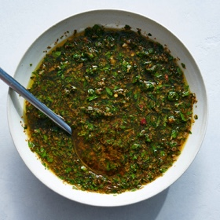

# [Chimichurri](https://cooking.nytimes.com/recipes/1020544-chimichurri)
> **tags**: #Mexican #5star

## Description

## Ingredients

- 1/4 cup dried oregano
- 1 teaspoon sweet paprika
- 1/2 teaspoon red-pepper flakes (more or less to taste)
- 1/2 teaspoon ground cumin (optional)
- 1/2 cup hot water
- Kosher salt
- 1/4 cup red wine vinegar
- 8 medium garlic cloves
- 2 tablespoons olive oil (it need not be extra-virgin, but it can be), plus more as needed
- 1/4 cup fresh oregano leaves, finely minced
- 1 tightly packed cup fresh parsley leaves, finely minced
- Ground black pepper

## Directions
Combine dried oregano, paprika, red-pepper flakes and cumin, if using, in a large bowl. Add hot water and a big pinch of salt and stir with a fork. Add vinegar and stir to combine.

Smash garlic with a pinch of salt in a mortar and pestle to form a rough paste, then drizzle in about 2 tablespoons of olive oil and work the garlic and oil around the mortar until it emulsifies and no loose oil remains. Scrape this garlic mixture into the bowl with the oregano mixture and stir to combine. (Alternatively, smash garlic cloves on a cutting board with the flat side of a chef’s knife. Sprinkle with a pinch of kosher salt, then use the side of your knife to scrape the mixture back and forth until a paste forms. Drizzle a little olive oil over the paste and work it in with the side of the knife. Repeat until you’ve added about a tablespoon of olive oil, then scrape the mixture up and transfer it to the bowl with the oregano mixture, add the remaining olive oil, and stir to combine.)

Add minced fresh oregano and parsley and stir to combine. Set aside at room temperature for at least 30 minutes, or in the refrigerator overnight, to allow the dried oregano to rehydrate and the flavors and texture to develop. Stir vigorously before tasting, then adjust seasoning with salt and fresh black pepper. Unused chimichurri can be stored in a sealed container in the refrigerator for several weeks.

## Notes

## Data
**prep**  | **cook**  | **total** 35 min | **serves** About 1 cup