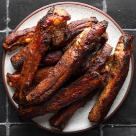

# [Chinese Spareribs](https://www.seriouseats.com/chinese-spareribs-char-siu-recipe)
> **tags**: #Mains #Pork #4star

## Description

## Ingredients

- 1 tablespoon Chinese five-spice powder
- 1 full rack St. Louis-style spareribs, cut into individual ribs (about 3 pounds total) (see note)
- 1/2 cup (120g) hoisin sauce
- 1/4 cup (60ml) Shaoxing wine or dry sherry
- 2 tablespoons (30ml) soy sauce
- 1/4 cup (80g) honey

## Directions
Sprinkle five-spice powder evenly over ribs and rub until thoroughly coated. Set ribs aside.

Combine hoisin sauce, shaoxing wine, soy sauce, and honey in a gallon-sized zipper lock bag. Add ribs to bag and mix until evenly coated. Seal bag, transfer to refrigerator, and let ribs marinate at least overnight and up to three nights.

When ready to cook, preheat oven to 375°F. Remove ribs from bag, wiping off excess marinade with your fingers (reserve marinade). Line a rimmed baking sheet with foil, set a wire rack in it, and spread the ribs evenly over the rack. Cover with aluminum foil and roast until a paring knife can be inserted into the meat with minimal resistance, about 1 hour 15 minutes. Remove foil, brush ribs with marinade, increase heat to 450°F, and roast until charred, glazed, and sticky, about 20 minutes longer, rotating ribs and basting with marinade once more during cooking. Let rest 10 minutes, then serve.

## Notes
You can add a few drops of red food coloring to the marinade if you want a deeper red hue to your ribs.

Baby back ribs will work just as well as St. Louis-cut.

## Data
**prep** 10 mins | **cook** 105 mins | **total**  | **serves** 3 to 5 servings