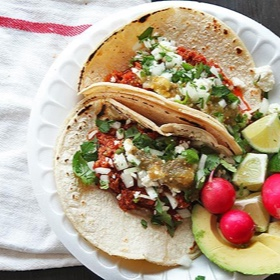

# [Chorizo](https://www.seriouseats.com/easy-fresh-mexican-chorizo)
> **tags**: #Mexican #5star

## Description

## Ingredients

- 1 1/2 pounds pork shoulder, cut into 1-inch cubes (see notes)
- 2 1/2 teaspoons kosher salt
- 1 tablespoon ancho chile powder
- 1/4 teaspoon ground achiote (optional, see notes)
- 3 medium cloves garlic, minced (about 1 tablespoon)
- 1/2 teaspoon dried Mexicano oregano
- 1 teaspoon ground cumin
- 1/2 teaspoon freshly ground black pepper
- 1/4 teaspoon ground cloves
- 1/4 teaspoon ground coriander seeds
- Pinch ground cinnamon
- 3 tablespoons red wine or distilled white vinegar

## Directions
Combine all ingredients in a large bowl and toss until homogenous. Let rest for at least 4 hours and up to overnight. When ready to grind, grind through a chilled meat grinder fitted with a 1/4-inch plate. Alternatively, working in 1/4-pound batches, pulse in a food processor until finely chopped. Knead chopped meat by hand in a large bowl, or with the paddle attachment in the stand mixer until slightly tacky. Cook as desired. Chorizo can be stored in a sealed container in the refrigerator for up to 5 days.

## Notes

## Data
**prep**  | **cook** 8 hrs | **total**  | **serves** 6 servings