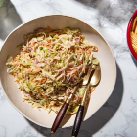

# [Classic Coleslaw](https://www.seriouseats.com/creamy-cole-slaw)
> **tags**: #Sides #Steph #5star

## Description

## Ingredients

### For the Slaw Mix
- 1 large head green cabbage, about 3 1/2 pounds, finely shredded on a mandoline or by hand (see notes)
- 1 large red onion, finely sliced on a mandoline or by hand
- 1 large carrot, peeled and grated on the large holes of a box grater (see notes)
- 1/4 cup roughly chopped fresh parsley leaves
- 1 cup white sugar
- 1/2 cup kosher salt

### For the Dressing
- 3/4 cup mayonnaise
- 1/4 cup apple cider vinegar
- 2 tablespoons dijon mustard
- 1 tablespoon freshly ground black pepper
- 3 tablespoons sugar

## Directions
For the Slaw Mix: Combine cabbage, onion, carrot, and parsley in a large bowl, leaving plenty of room to toss (you may have to use 2 large bowls if your bowls are not large enough). Sprinkle with sugar and salt and toss to combine. Let rest 5 minutes, then transfer to a large colander and rinse thoroughly under cold running water.

Transfer rinsed mixture to a salad spinner and spin dry. Alternatively, transfer to a large rimmed baking sheet lined with a triple layer of paper towels or a clean kitchen towel and blot mixture dry with more paper towels. Return to large bowl and set aside.

For the Dressing: Combine mayonnaise, vinegar, mustard, black pepper, and sugar in a medium bowl and whisk until homogenous.

Pour dressing over cabbage mixture and toss to coat. Taste and adjust seasoning with more salt, pepper, sugar, and/or vinegar if desired.

## Notes
This recipe is easiest to produce with a mandoline-style slicer, though you can also finely shred the cabbage by hand. To slice cabbages on a mandoline, split the head in half, cut out the core using the tip of a sharp chef's knife, then quarter the cabbage and slice it with the mandoline set to 1/16 of an inch.

When grating the carrot, make sure to hold at a steep vertical bias so that the shreds are long instead of short.

## Data
**prep** 35 mins | **cook** 0 mins | **total**  | **serves** 12 servings