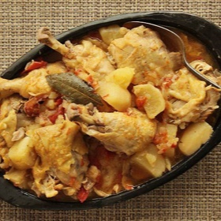

# [Colombian Chicken Stew with Potatoes, Tomato, and Onion](https://www.seriouseats.com/colombian-chicken-stew-with-potatoes-tomato-onion-recipe)
> **tags**: #Dinner #Easy #5star

## Description

## Ingredients

- 4 large Russet or Yukon Gold potatoes, peeled and cut into 1- to 2-inch chunks
- 1 large onion, sliced into 1/4-inch slices (about 1 1/2 cups)
- 4 medium beefsteak tomatoes, cut into 1- to 2-inch chunks (about 3 cups)
- 1 whole chicken, back removed, cut into 8 pieces (about 4 pounds), or 4 whole chicken legs, cut into thighs and drumsticks
- 2 bay leaves
- salt
- black pepper

## Directions
Combine potatoes, onion, tomatoes, chicken pieces, bay leaves, and a large pinch of salt in a pressure cooker. Toss with hands to combine. Seal lid and cook under high pressure for 25 minutes. Release pressure, remove lid, season to taste, and serve.

## Notes

## Data
**prep** 0 mins | **cook** 35 mins | **total**  | **serves** 4 servings