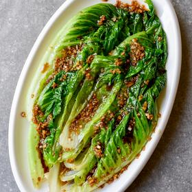

# [Cooked Lettuce with Oyster Sauce & Garlic](https://thewoksoflife.com/cooked-lettuce-with-oyster-sauce-garlic/)
> **tags**: #Asian #4star

## Description

## Ingredients

- 10 ounces romaine lettuce
- 3 tablespoons vegetable oil
- 4 cloves garlic (minced, about 2 tablespoons)
- 1 tablespoon light soy sauce (or to taste)
- 1 tablespoon oyster sauce (or vegetarian oyster sauce)
- 3 tablespoons water

## Directions
Separate the romaine into individual leaves. Wash the leaves clean, paying special attention to the base of the stems, which hold the most dirt! Drain, leaving the leaves whole.

Bring a pot of water to a boil.

Meanwhile, in a small saucepan over medium heat, heat 2 tablespoons of oil. Add the minced garlic…

And the light soy sauce, oyster sauce and 3 tablespoons of water. Bring the mixture to a simmer, and then turn off the heat. Set aside.

When your water is boiling, add the remaining 1 tablespoon of oil, along with the romaine lettuce leaves.

The small amount of added oil will give the lettuce a shiny, more appetizing appearance.

Cook for about 20 seconds, to lightly wilt the lettuce.

Immediately scoop them out of the pot. Drain off any excess water, and lay them on a serving plate.

Pour the sauce over the top.

Serve immediately. This makes a great easy side dish anytime of year, but especially during the summer!

## Notes

## Data
**prep** 10 minutes | **cook** 5 min | **total**  | **serves** Serves: 3