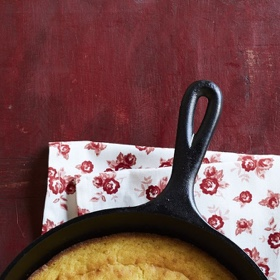

# [Cornbread](https://www.thepioneerwoman.com/food-cooking/recipes/a9486/skillet-cornbread/)
> **tags**: #Charlie #Quick Bread #0star

## Description

## Ingredients

- 1 c. yellow cornmeal
- 1/2 c. all-purpose flour
- 1 tsp. salt
- 1 tbsp. baking powder
- 1 c. buttermilk
- 1/2 c. milk
- 1 whole egg
- 1/2 tsp. baking soda
- 1/4 c. butter or shortening (Ree uses butter)
- 2 tbsp. butter or shortening (Ree uses butter)

## Directions
Preheat oven to 450 degrees. Combine cornmeal, flour, salt, and baking powder in a bowl. Stir together.

Measure the buttermilk and milk in a measuring cup and add the egg. Stir together with a fork. Add the baking soda and stir. Pour the milk mixture into the dry ingredients. Stir with a fork until combined.

In a small bowl, melt 1/4 butter or shortening. Slowly add to the batter, stirring until just combined. In an iron skillet, melt the remaining 2 tablespoons butter or shortening over medium heat. Pour the batter into the hot skillet. Spread to even out the surface. (Batter should sizzle.)

Cook on stovetop for 1 minute, then bake for 20 to 25 minutes or until golden brown. Edges should be crispy!

## Notes

## Data
**prep** 5 mins | **cook** 20 mins | **total**  | **serves** Yields: 12