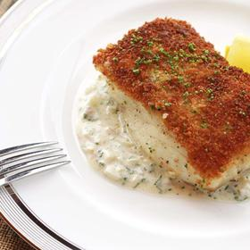

# [Crispy Pan-Seared Fish](https://www.seriouseats.com/the-easiest-crispy-pan-seared-fish-food-lab-recipe)
> **tags**: #Easy #Fish #Steph #5star

## Description

## Ingredients

- 4 thick white fish fillets or steaks (such as halibut, striped bass, sea bass, or swordfish), 5 to 8 ounces each
- Kosher salt and freshly ground black pepper
- 1/2 cup all purpose flour
- 1 large egg, beaten
- 1 1/2 cups panko-style breadcrumbs (see note)
- 3 tablespoons vegetable, canola, or peanut oil
- Lemon wedges or tartar sauce (either store-bought or homemade) for serving

## Directions
Adjust oven rack to center position and preheat oven to 300°F (150°C). Pat fish dry on paper towels and season generously with salt and pepper. Place flour, egg, and breadcrumbs in 3 separate shallow bowls or plates. Season each gently with salt and pepper. Working one piece at a time, lift fish and dip, presentation-side-down, in the flour, followed by the egg, followed by the breadcrumbs, pressing down firmly until a thick layer of breadcrumbs adheres. Place fish breaded-side-up on a clean plate and repeat with remaining fish.

Heat oil in a large non-stick or cast iron skillet over medium heat until shimmering. Add fish pieces, breaded-side-down and cook, swirling and rotating them around the pan until deep golden brown, about 5 minutes. Carefully flip fish and transfer to oven. Cook until an instant-read thermometer inserted into the deepest part of the fish registers 140°F (60°C), about 5 minutes (a knife or a cake tester inserted into the fish should show no resistance). Serve immediately with lemon wedges or tartar sauce.

## Notes

## Data
**prep** 5 mins | **cook** 15 mins | **total**  | **serves** 4 servings