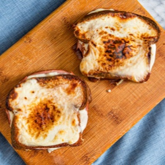

# [Croques Monsieur](https://www.seriouseats.com/croque-monsieur-recipe)
> **tags**: #French #Sandwich #5star

## Description

## Ingredients

- 5 1/2 tablespoons (80g) unsalted butter, plus more if necessary, divided
- 1 1/2 tablespoons (12g) all-purpose flour
- 1 cup (235ml) milk
- 6 ounces (170g) grated Gruyère, Comté, or Swiss cheese, plus more if desired, divided
- Kosher salt and freshly ground black pepper
- 8 (1/4 inch thick) slices soft bread, such as brioche or good-quality sandwich bread
- 8 ounces (225g) good-quality thinly sliced ham (about 16 slices)
- 4 teaspoons (20ml) Dijon mustard

## Directions
Preheat oven to 350°F (180°C). In a small saucepan, heat 1 1/2 tablespoons butter with flour over medium-high heat, until butter has melted and formed a paste with flour. Continue to cook, stirring, until raw flour scent is gone, about 1 minute. Whisk in milk until smooth and cook, whisking, until sauce comes to a simmer and begins to thicken slightly. Lower heat to low and cook, stirring, until sauce is thick enough to coat the back of a wooden spoon, about 3 minutes. Whisk in 4 ounces cheese (reserving the rest for inside the sandwiches) until smooth, moving saucepan on and off heat to keep it hot enough to melt cheese but not so hot that it bubbles rapidly. Season Mornay sauce with salt and pepper and keep warm.

In a large cast iron skillet, working in batches, toast both sides of each slice of bread in remaining butter over medium heat until golden, about 2 minutes per side; swirl pan and rotate bread for even browning, and add more butter as necessary if pan dries out.

Transfer bread to a work surface. Arrange ham on top of half the bread slices, then spread a generous layer of Mornay sauce on top of ham. Sprinkle with remaining grated cheese. Spread Dijon mustard on each of the remaining bread slices and close sandwiches. Spread additional Mornay sauce on top of each sandwich from edge to edge; sprinkle additional grated cheese on top, if desired.

Transfer sandwiches to a baking sheet and heat in oven until sandwiches are warmed throughout and cheese is melted. Turn on broiler, then broil sandwiches on top rack until lightly browned on top, about 2 minutes. (Keep an eye on them, as some broilers are very powerful.) Serve right away.

## Notes

## Data
**prep**  | **cook** 30 mins | **total**  | **serves** 4 servings