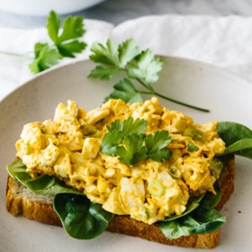

# [Curried Egg Salad](https://downshiftology.com/recipes/curried-egg-salad/)
> **tags**: #Lunch #5star

## Description

## Ingredients

- 6 eggs, room temperature
- 1/3 cup mayonnaise, or more for extra creaminess
- 1/2 cup carrot, grated, from one small carrot
- 1 onion, sliced
- 1 teaspoon curry powder
- salt and pepper, to taste
- 2 tbs chopped parsley, for garnish

## Directions
Bring a pot of water to a boil. Then turn the heat to low so there's no bubbles. Use a skimmer to slowly and gently place the eggs in the pot. Turn the heat back to high and boil the eggs for 12-14 minutes.

Transfer the eggs to an ice water bath for a few minutes to stop the cooking process and cool.

Once your eggs are cool to touch, peel and discard the eggs shells.

Cut the hard boiled eggs to your desired size (I prefer chunky).

Add the eggs, mayonnaise, grated carrots, green onion, curry powder, salt and pepper to bowl and stir all ingredients together. Sprinkle with parsley.

Serve on its own or in a wrap or sandwich and enjoy!

LISA'S TIPS

To store: While this recipe tastes best when it's freshly made, you can store it in the fridge in a container for up to 3-4 days. Just make sure that you don't leave this out at room temperature for more than 2 hours. Otherwise, it will start to go bad.

To meal prep: This is also a great make-ahead recipe that can be eaten straight out of the fridge.

The eggs may crack if you introduce cold eggs straight to the boiling hot water. So I leave my eggs out prior to boiling, or run them under lukewarm water for a few seconds, as well as turn off the boil right before you introduce the eggs.

I use a skimmer to introduce the eggs to boiling water so they don't slam into the bottom of the pan and crack. You can see more tips on how to make hard boiled eggs here.

If you're not a fan of mayonnaise, give this a try with Greek yogurt. It's just as delicious!

## Notes

## Data
**prep** 10 mins | **cook** 15 mins | **total**  | **serves** Servings: 4 servings