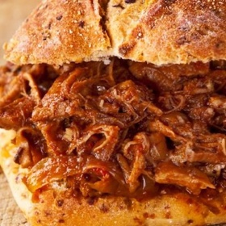

# [Dr Pepper Pulled Pork](https://www.seriouseats.com/slow-cooked-pulled-pork-dr-pepper-recipe)
> **tags**: # #0star

## Description

## Ingredients

- 1 small boneless, skin-off pork shoulder roast, about 2 pounds
- 1 can of Dr Pepper
- 1 teaspoon honey
- 1 tablespoon balsamic vinegar
- 1/2 teaspoon salt
- 1/2 teaspoon freshly ground black pepper
- 2 cups store-bought or homemade Kansas City-style barbecue sauce
- 6 soft hamburger buns

## Directions
In a heavy-bottomed pan over medium-high heat, brown pork on all sides. Transfer roast to slow cooker. Return pan to stove.

Pour Dr Pepper into pan and deglaze, using a spatula to scrape up all the pork bits on the bottom. Let cook for 2 minutes, scraping the bottom occasionally.

Pour Dr Pepper over meat in slow cooker. Add honey, balsamic vinegar, salt, and pepper. Stir well. Cover and cook on low for 7 hours.

After meat has cooked for 7 hours, drain off any excess liquid and shred meat into small bits with 2 forks. Add barbecue sauce to pork and stir well. Cover slow cooker and cook for 1 more hour.

Add more salt and pepper to taste. Fill burger buns with pork and serve immediately.

## Notes

## Data
**prep**  | **cook** 8 hrs | **total**  | **serves** 4 to 6 servings