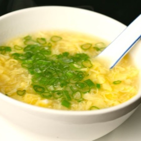

# [Egg Drop Soup](https://www.seriouseats.com/chinese-egg-drop-soup-recipe)
> **tags**: #Soup #5star

## Description

## Ingredients

- 1 quart homemade or store-bought low-sodium chicken broth
- 4 ounces Chinese ham, Chinese dried sausage, or slab bacon
- 6 scallions, greens thinly sliced, whites left whole
- 1-inch knob of ginger
- 1 teaspoon whole white peppercorns
- Kosher salt
- 4 teaspoons cornstarch
- 2 whole eggs

## Directions
Combine stock, ham, scallion whites, ginger, and peppercorns in a small stockpot and bring to a boil over high heat. Reduce to a bare simmer and cook for 30 minutes. Strain broth, discard solids, and season to taste with salt.

Combine 1 tablespoon cornstarch with 1 tablespoon water in a small bowl and mix with a fork until homogeneous. Whisk into broth and bring to a simmer. Reduce heat to low.

Whisk together eggs and remaining teaspoon cornstarch until homogeneous. Transfer eggs to a small bowl and hold the tines of a fork or two chopsticks over the edge of it. Swirl the soup once with a large spoon, then slowly drizzle egg mixture into soup. Allow soup to sit for 15 seconds, then stir gently to break up the egg to desired size. Sprinkle with scallion greens and serve.

## Notes

## Data
**prep** 5 mins | **cook** 45 mins | **total**  | **serves** 4 servings