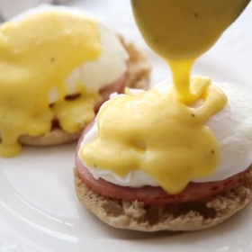

# [Eggs Benedict](https://tastesbetterfromscratch.com/eggs-benedict-with-homemade-hollandaise-sauce/)
> **tags**: #Breakfast #0star

## Description

## Ingredients

- 2 English muffins
- 4 eggs
- 4 slices Canadian bacon
- Vinegar , just a splash

### For the Hollandaise sauce
- 4 Tablespoons butter
- 4 egg yolks
- 2 teaspoons lemon juice , or lime juice
- 1 Tablespoon heavy whipping cream
- salt and pepper (to taste)

## Directions
For the Hollandaise sauce:

Melt the butter in a small saucepan. In a separate small bowl, beat the egg yolks. Mix in lemon juice, whipping cream, and salt and pepper.

Add a small spoonful of the hot melted butter to the egg mixture and stir well. Repeat this process adding a spoonful at a time of hot butter to the egg mixture.( Adding the butter slowly, a spoonful at a time, will temper the eggs and ensure they don't curdle).

Once the butter has been incorporated, pour the mixture back into the saucepan. Cook on low heat, stirring constantly, for just 20-30 seconds. Remove from heat and set aside. It will thicken as it cools. Stir well and add another splash of cream, if needed, to thin.

To poach the eggs:

Fill a medium size pot with about 3 inches of water. Bring the water to a boil and then reduce heat until it reaches a simmer. You should see small bubbles coming to the surface but not rolling.

Add a little splash of vinegar to the water (this is optional, but it helps the egg white to stay together once it is in the water).

Crack one egg into a small cup (I use a measuring cup). Lower the egg into the simmer water, gently easing it out of the cup.

Cook the egg in simmering water for 3-5 minutes, depending on how soft you want your egg yolk. Remove the poached egg with a slotted spoon.

**It is not abnormal for a white foam to form on top of the water when poaching an egg. You can simple skim the foam off of the water with a spoon.

While the egg is cooking, place the slices of Canadian bacon in a large pan and cook on medium-high heat for about 1 minute on each side.

To Assemble:

Toast the English muffin. Top each toasted side with a slice or two of Canadian bacon, and then a poached egg. Top with hollandaise sauce.

## Notes

## Data
**prep** 10 mins | **cook** 25 mins | **total**  | **serves** Servings 4 people